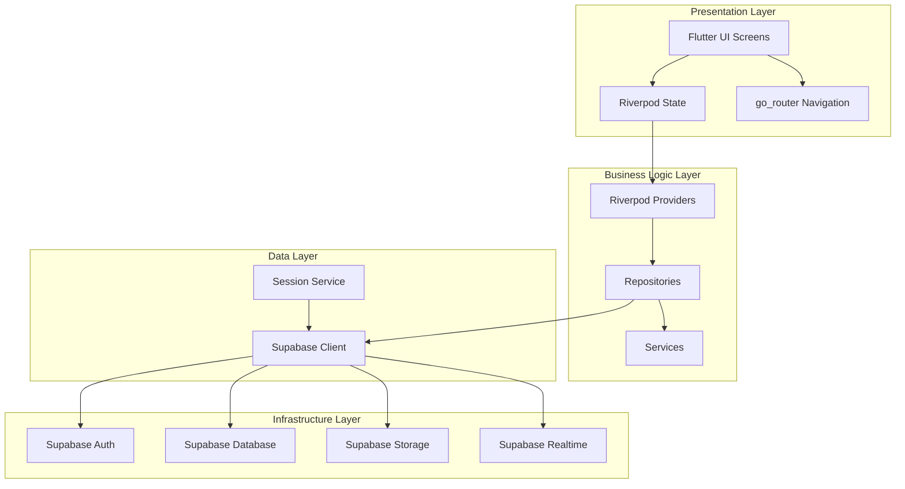

# System Architecture

## Overview
CodeNyx follows a clean architecture pattern with clear separation of concerns. The application is built using Flutter for the frontend and Supabase as the backend-as-a-service.

## Architecture Layers

### 1. Presentation Layer (UI)
**Location**: `lib/features/*/` screens
**Responsibilities**:
- Display user interface
- Handle user interactions
- Manage UI state (loading, error, success)
- Navigate between screens

**Key Components**:
- Screens (Widgets)
- State management (Riverpod providers)
- Navigation (go_router)

### 2. Business Logic Layer
**Location**: `lib/features/*/` repositories and services
**Responsibilities**:
- Implement business rules
- Coordinate data operations
- Handle data transformation
- Manage state updates

**Key Components**:
- Repositories (data access)
- Services (business logic)
- Providers (state management)

### 3. Data Layer
**Location**: `lib/services/` and Supabase
**Responsibilities**:
- Handle data persistence
- Manage API calls
- Cache data when needed
- Handle authentication

**Key Components**:
- Supabase client
- Session service
- Storage service

### 4. Infrastructure Layer
**Location**: Supabase (backend)
**Responsibilities**:
- Database operations
- Authentication
- File storage
- Real-time subscriptions

## Architecture Diagram



## Feature-Based Architecture

Each feature is self-contained with its own:
- **Screen**: UI component
- **Repository**: Data access
- **Provider**: State management
- **Model**: Data structures
- **Service**: Business logic

This promotes:
- **Modularity**: Features can be developed independently
- **Reusability**: Features can be easily reused
- **Testability**: Each feature can be tested in isolation
- **Maintainability**: Changes to one feature don't affect others

## Data Flow Architecture

### Unidirectional Data Flow
The application follows a unidirectional data flow pattern:

1. **User Action** → UI triggers action
2. **State Update** → Provider updates state
3. **Repository Call** → Repository calls Supabase
4. **Data Response** → Supabase returns data
5. **State Update** → Provider updates state with data
6. **UI Rebuild** → UI rebuilds with new state

### Real-time Data Flow
For real-time features (chat), the application uses streams:

1. **Subscription** → Repository subscribes to Supabase realtime
2. **Stream Provider** → Riverpod StreamProvider exposes stream
3. **UI Listen** → UI listens to stream
4. **Data Push** → Supabase pushes new data
5. **UI Update** → UI automatically updates

## State Management Architecture

### Riverpod Pattern
The application uses Riverpod for state management:

**Provider Types Used**:
- **Provider**: For immutable values (repositories)
- **StateNotifierProvider**: For mutable state (not currently used)
- **StreamProvider**: For real-time data (chat messages)
- **FutureProvider**: For async data (not currently used)

**Provider Scoping**:
- Global providers defined at app level
- Feature-specific providers defined in feature modules
- `keepAlive()` used for persistent streams

### Local State vs Global State
- **Local State**: Managed within widgets (TextEditingController, form state)
- **Global State**: Managed by Riverpod (repositories, streams, caches)

## Navigation Architecture

### go_router Pattern
The application uses go_router for declarative routing:

**Route Structure**:
```dart
GoRouter(
  routes: [
    GoRoute(path: '/', builder: (context, state) => AuthScreen()),
    GoRoute(path: '/feed', builder: (context, state) => FeedScreen()),
    GoRoute(path: '/chat', builder: (context, state) => ChatScreen()),
    // ... more routes
  ],
)
```

**Navigation Benefits**:
- Type-safe navigation
- Deep linking support
- Browser URL synchronization
- Route guards for authentication

## Service Architecture

### Singleton Services
Services are implemented as singletons:
- `SessionService`: Manages user session
- `SupabaseClient`: Supabase client instance
- `PostState`: In-memory post cache

### Service Lifecycle
- Services initialized at app startup
- Persist throughout app lifetime
- Cleaned up on app termination

## Security Architecture

### Authentication Flow
1. User clicks "Sign in with Google"
2. Supabase Auth handles OAuth
3. User redirected back with session
4. Session stored in SessionService
5. User data fetched from profiles table
6. Team ID extracted and stored

### Authorization
- **Row-Level Security (RLS)**: Supabase RLS policies on all tables
- **Team-Based Access**: Users can only access their team's data
- **Admin Checks**: Admin screens check for admin role

### Data Security
- All API calls authenticated with Supabase session
- Sensitive data not stored locally
- Session tokens managed by Supabase

## Performance Architecture

### Optimization Strategies
1. **Image Compression**: Images compressed before upload
2. **Pagination**: Large datasets paginated
3. **Caching**: Post data cached in memory
4. **Lazy Loading**: Lists loaded on demand
5. **Real-time Subscriptions**: Only subscribe to needed data

### Memory Management
- Stream providers use `keepAlive()` to prevent disposal
- Controllers disposed in widget dispose
- Large lists use ListView.builder

## Scalability Architecture

### Horizontal Scaling
- Supabase handles backend scaling
- Stateless Flutter app can scale horizontally
- CDN for static assets

### Vertical Scaling
- Database queries optimized with indexes
- Efficient data fetching (select only needed columns)
- Real-time subscriptions filtered by team

## Error Handling Architecture

### Error Propagation
1. Repository throws exception
2. Provider catches and updates error state
3. UI displays error message
4. User can retry action

### Error Types
- Network errors (connection issues)
- Authentication errors (session expired)
- Validation errors (invalid input)
- Server errors (Supabase issues)

## Testing Architecture

### Test Structure
- Unit tests for repositories
- Widget tests for screens
- Integration tests for flows

### Mock Strategy
- Mock Supabase client for tests
- Mock repositories for widget tests
- Fake services for integration tests

## Deployment Architecture

### Build Process
1. Flutter build for target platform
2. Assets bundled
3. Code optimized
4. Package generated

### Deployment Targets
- **iOS**: App Store via TestFlight/Production
- **Android**: Play Store via internal testing/Production
- **Web**: Static hosting (Vercel, Netlify, GitHub Pages)

## Monitoring Architecture

### Error Tracking
- Supabase logs for backend errors
- Flutter crash reporting (if configured)
- Console logging for development

### Analytics
- User engagement tracking (if added)
- Feature usage metrics (if added)
- Performance monitoring (if added)
