# Request Flow

## Overview
This document explains how user requests flow through the CodeNyx application from UI interaction to data persistence and back.

## General Request Flow Pattern

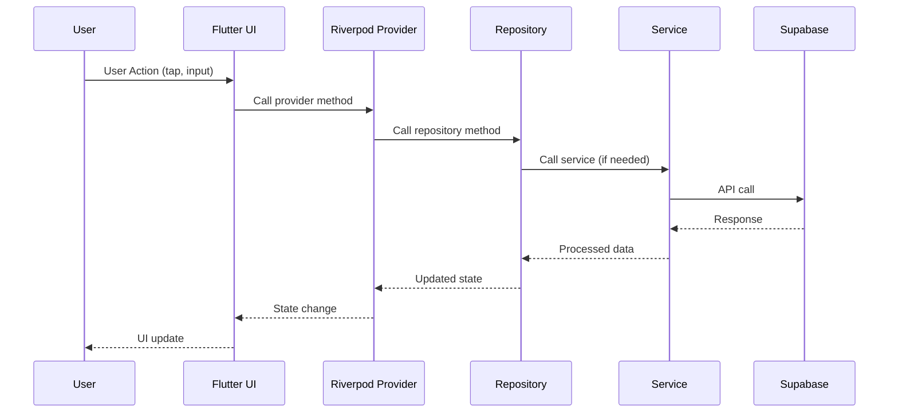

## Authentication Request Flow

### Google OAuth Sign-In

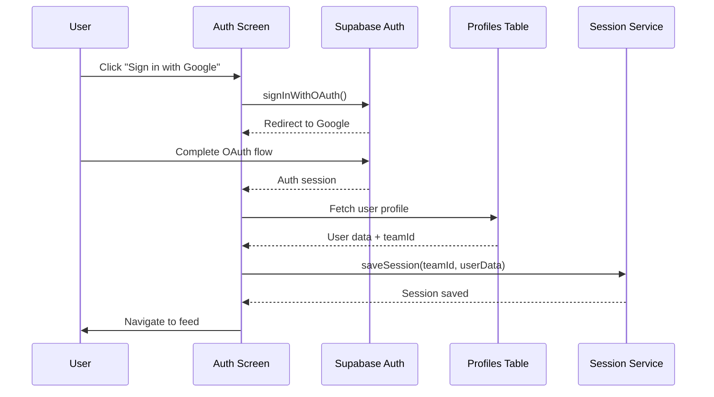

**Steps**:
1. User taps "Sign in with Google" button
2. AuthScreen calls Supabase `signInWithOAuth()`
3. User completes OAuth flow in browser
4. Supabase returns auth session
5. App fetches user profile from `profiles` table
6. Team ID extracted from profile
7. Session saved using SessionService
8. User navigated to feed screen

## Social Feed Request Flows

### Create Post Request

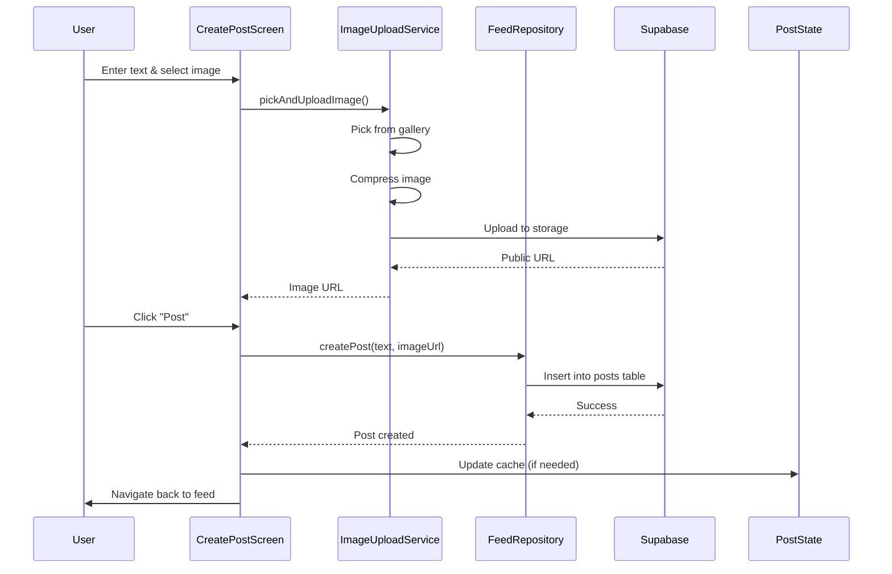

**Steps**:
1. User enters text and optionally selects image
2. ImageService picks image from gallery
3. Image compressed to reduce size
4. Image uploaded to Supabase Storage
5. Public URL returned
6. User clicks "Post" button
7. FeedRepository inserts post into `posts` table
8. PostState cache updated (if needed)
9. User navigated back to feed

### Like Post Request

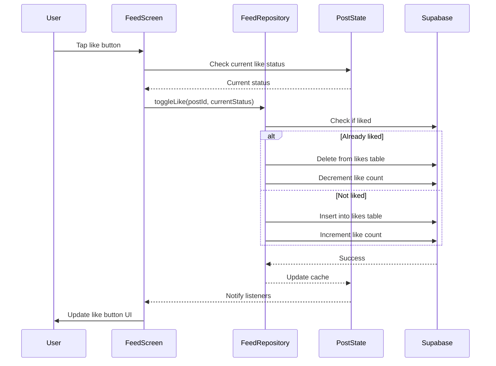

**Steps**:
1. User taps like button
2. PostState checks current like status
3. FeedRepository toggles like in Supabase
4. If liked: delete from `likes` table, decrement count
5. If not liked: insert to `likes` table, increment count
6. PostState cache updated for instant UI feedback
7. UI updated with new like status

### Add Comment Request

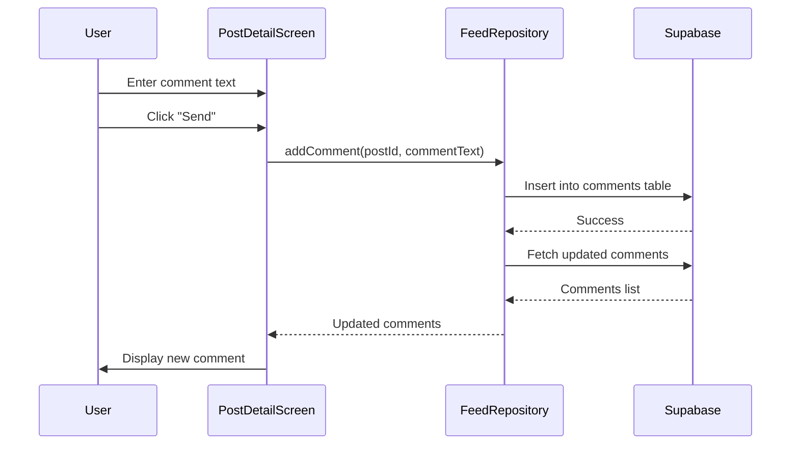

**Steps**:
1. User enters comment text
2. User clicks "Send" button
3. FeedRepository inserts comment into `comments` table
4. FeedRepository fetches updated comments
5. UI updated with new comment

## Chat Request Flows

### Send Message Request

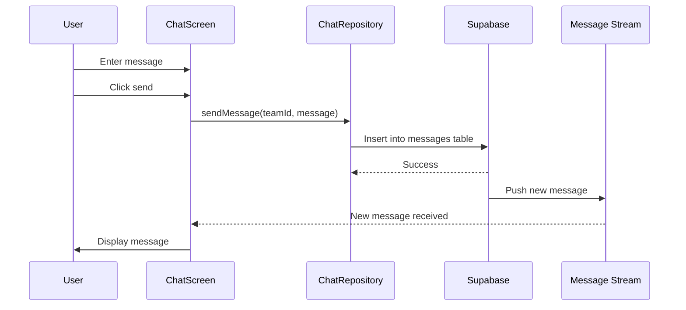

**Steps**:
1. User enters message text
2. User clicks send button
3. ChatRepository inserts message into `messages` table
4. Supabase realtime pushes new message
5. StreamProvider receives new message
6. UI updated with new message

### Receive Real-time Message

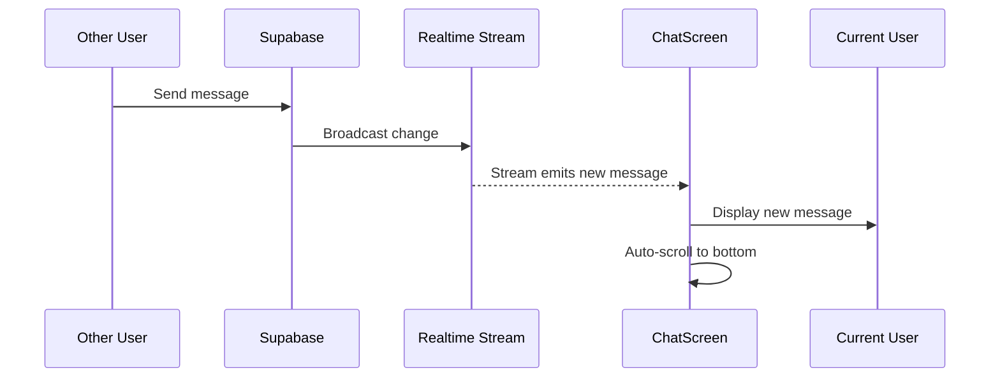

**Steps**:
1. Other user sends message via their app
2. Supabase broadcasts change via realtime
3. StreamProvider emits new message
4. Current user's UI updates automatically
5. Chat auto-scrolls to show new message

## Admin Request Flows

### Create Announcement Request

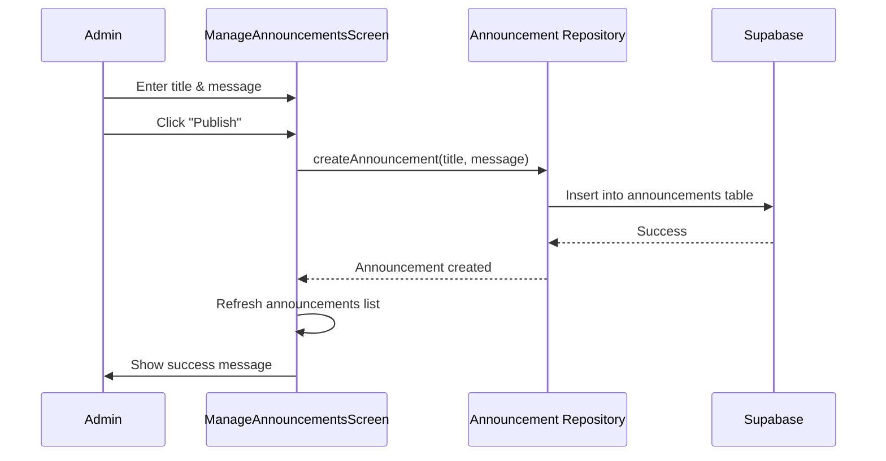

**Steps**:
1. Admin enters title and message
2. Admin clicks "Publish" button
3. Repository inserts announcement into `announcements` table
4. Announcements list refreshed
5. Success message displayed

### Update Mentor Request Status

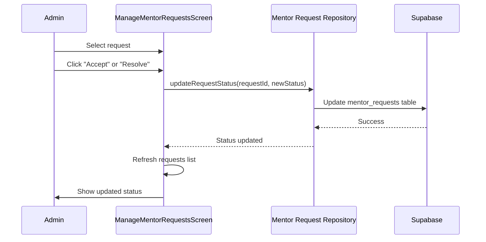

**Steps**:
1. Admin selects a mentor request
2. Admin clicks status update button
3. Repository updates status in `mentor_requests` table
4. Requests list refreshed
5. Updated status displayed

## Complaint Request Flows

### Submit Complaint Request

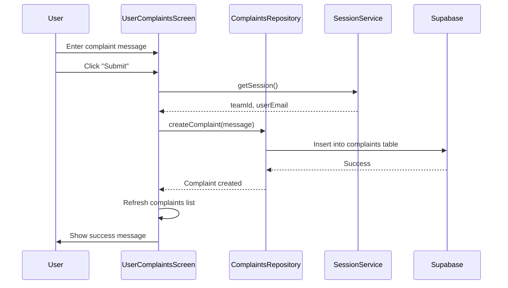

**Steps**:
1. User enters complaint message
2. User clicks "Submit" button
3. SessionService retrieves team ID and user email
4. Repository inserts complaint into `complaints` table
5. Complaints list refreshed
6. Success message displayed

### Resolve Complaint Request (Admin)

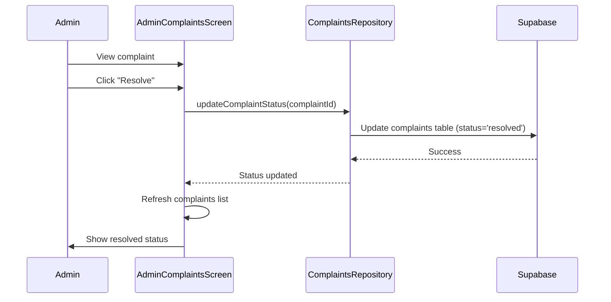

**Steps**:
1. Admin views complaint details
2. Admin clicks "Resolve" button
3. Repository updates status to 'resolved' in `complaints` table
4. Complaints list refreshed
5. Resolved status displayed

## Error Handling Flow

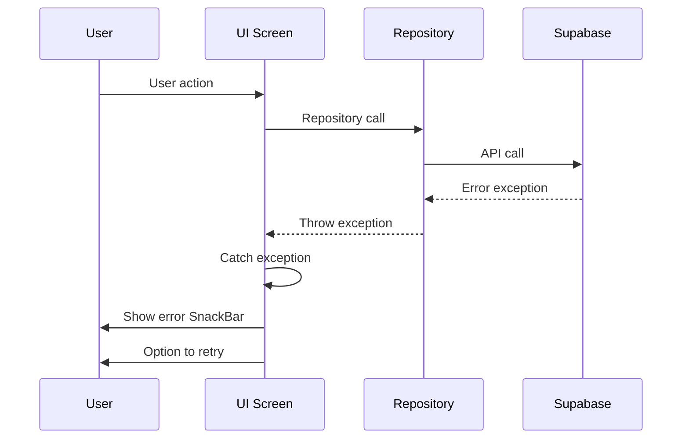

**Error Handling Steps**:
1. User performs action
2. Repository calls Supabase
3. Supabase returns error
4. Repository throws exception
5. UI catches exception
6. Error message displayed to user
7. User can retry the action

## Navigation Flow

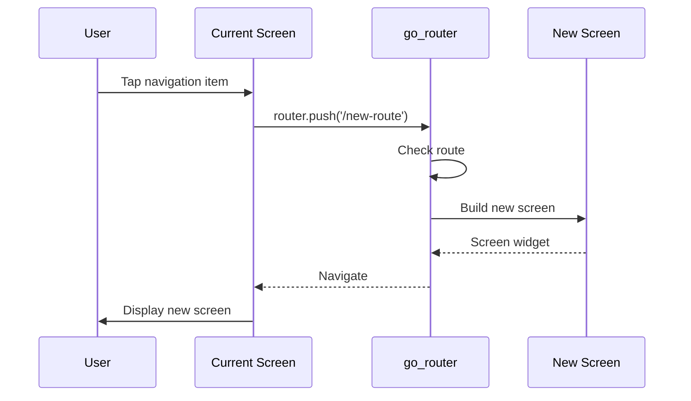

**Navigation Steps**:
1. User taps navigation item
2. UI calls go_router with route path
3. Router validates route
4. New screen built
5. Navigation performed
6. New screen displayed
