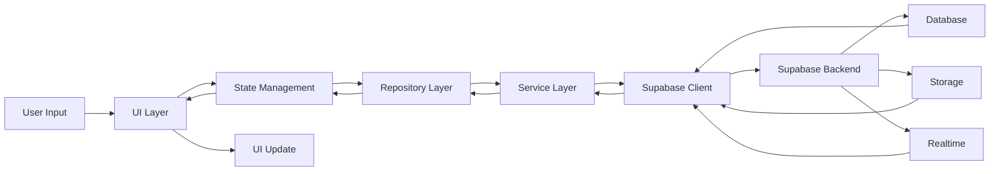
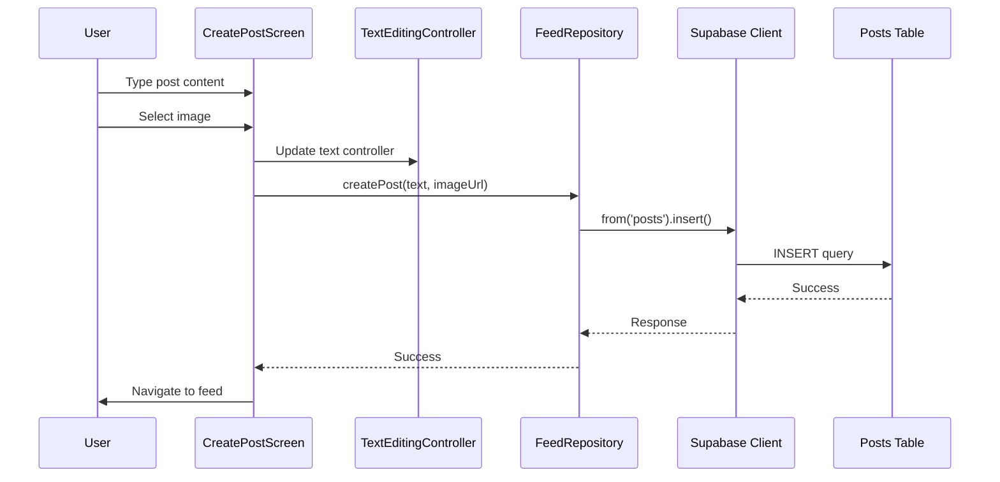
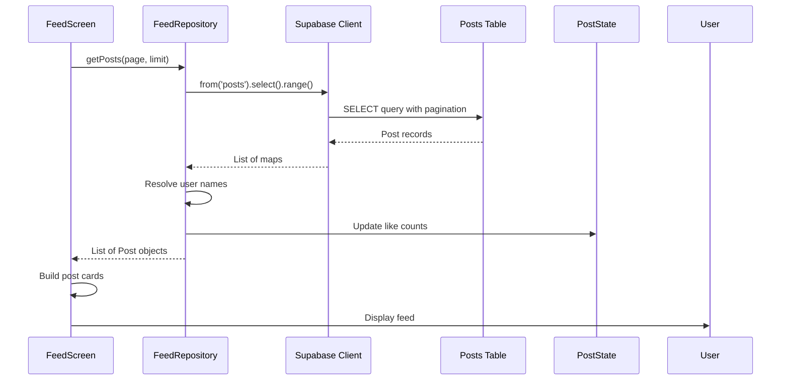
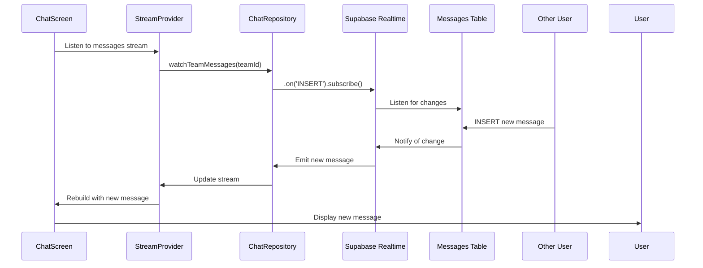

# Data Flow

## Overview
This document explains how data moves through the CodeNyx application, from user input to database storage and back to the UI.

## Data Flow Architecture



## Data Flow Patterns

### 1. Write Data Flow (User → Database)

**Example: Creating a Post**



**Data Transformations**:
1. **User Input**: Raw text and image file
2. **Image Processing**: Compressed and uploaded to Storage
3. **Data Preparation**: Text trimmed, URL generated
4. **Database Insert**: Structured data inserted into `posts` table
5. **Response**: Success confirmation

### 2. Read Data Flow (Database → UI)

**Example: Loading Feed**



**Data Transformations**:
1. **Database Query**: Raw records from `posts` table
2. **Data Mapping**: Maps converted to domain objects
3. **Data Enrichment**: User names resolved from `profiles` table
4. **State Caching**: Like counts cached in PostState
5. **UI Rendering**: Data displayed in widgets

### 3. Real-time Data Flow

**Example: Chat Messages**



**Real-time Flow**:
1. **Subscription**: UI subscribes to message stream
2. **Database Listener**: Supabase listens for INSERT events
3. **Change Detection**: New message detected
4. **Stream Emission**: New data emitted through stream
5. **UI Update**: UI automatically rebuilds with new data

## Data Flow by Feature

### Social Feed Data Flow

**Create Post Flow**:
```
User Input (text + image)
    ↓
Image Upload Service
    ↓ (compress → upload → URL)
FeedRepository.createPost()
    ↓ (insert with user_id, team_id, image_url)
Supabase (posts table)
    ↓
Success Response
    ↓
Navigate to Feed
```

**Load Feed Flow**:
```
FeedScreen.initState()
    ↓
FeedRepository.getPosts(page, limit)
    ↓ (select with pagination, order by created_at)
Supabase (posts table)
    ↓ (raw records)
User Name Resolution (profiles table)
    ↓
PostState Cache Update
    ↓
UI Render (PostCard widgets)
```

**Like Post Flow**:
```
User taps like button
    ↓
PostState.checkLikeStatus()
    ↓
FeedRepository.toggleLike()
    ↓ (insert/delete in likes table)
Supabase (likes table)
    ↓ (update like count in posts table)
PostState.updateCache()
    ↓
Instant UI Update
```

### Chat Data Flow

**Send Message Flow**:
```
User types message
    ↓
User taps send
    ↓
ChatRepository.sendMessage()
    ↓ (insert with team_id, user_id, message)
Supabase (messages table)
    ↓
Realtime broadcast
    ↓
All team members receive
    ↓
UI auto-update
```

**Receive Message Flow**:
```
StreamProvider subscription
    ↓
ChatRepository.watchTeamMessages()
    ↓ (realtime subscription)
Supabase Realtime
    ↓ (on INSERT event)
Stream emits new message
    ↓
UI rebuilds
    ↓
Auto-scroll to bottom
```

### Admin Data Flow

**Create Announcement Flow**:
```
Admin enters title + message
    ↓
Admin clicks publish
    ↓
AnnouncementRepository.create()
    ↓ (insert with created_at)
Supabase (announcements table)
    ↓
Refresh announcements list
    ↓
UI update
```

**User View Announcements Flow**:
```
UserUpdatesScreen.initState()
    ↓
AnnouncementRepository.getAll()
    ↓ (select, order by created_at desc)
Supabase (announcements table)
    ↓
UI render (AnnouncementCard widgets)
```

### Complaints Data Flow

**Submit Complaint Flow**:
```
User enters complaint
    ↓
SessionService.getSession()
    ↓ (get team_id, user_email)
ComplaintsRepository.create()
    ↓ (insert with user_email, team_id, status='pending')
Supabase (complaints table)
    ↓
Refresh complaints list
    ↓
UI update
```

**Admin Resolve Complaint Flow**:
```
Admin views complaint
    ↓
Admin clicks resolve
    ↓
ComplaintsRepository.updateStatus()
    ↓ (update status='resolved')
Supabase (complaints table)
    ↓
Refresh complaints list
    ↓
UI update
```

## Data Caching Strategy

### PostState Cache
**Purpose**: Cache post like counts and user like status for instant UI updates

**Flow**:
```
Post loaded from database
    ↓
PostState.updateLikeCount(postId, count)
    ↓
PostState.updateUserLiked(postId, isLiked)
    ↓
Cache stored in memory
    ↓
UI reads from cache (instant)
    ↓
Background sync with database
```

**Benefits**:
- Instant UI feedback
- Reduced database queries
- Optimistic updates
- Better user experience

## Data Validation Flow

**Input Validation**:
```
User input
    ↓
Client-side validation (empty check, length check)
    ↓
Error if invalid
    ↓ (if valid)
Data preparation (trim, sanitize)
    ↓
Repository call
    ↓
Server-side validation (RLS policies)
    ↓
Database constraints
    ↓
Success or error
```

## Error Recovery Flow

```
User action
    ↓
Repository call
    ↓
Supabase error
    ↓
Exception thrown
    ↓
UI catches exception
    ↓
Error message displayed
    ↓
User can retry
    ↓
Retry action
    ↓
Success or error again
```

## Data Synchronization

### Session Data Flow
```
User authenticates
    ↓
Supabase Auth session created
    ↓
User profile fetched
    ↓
SessionService.saveSession()
    ↓ (team_id, user_email, user_name)
Session stored
    ↓
Used throughout app
```

### Real-time Synchronization
```
Database change
    ↓
Supabase Realtime detects
    ↓
Subscription notified
    ↓
Stream emits new data
    ↓
UI rebuilds
    ↓
User sees update
```

## Data Security Flow

### Authenticated Request Flow
```
User action
    ↓
Supabase client includes auth token
    ↓
Request sent to Supabase
    ↓
RLS policy check
    ↓ (user_id == auth.uid())
    ↓
Query executed
    ↓
Response returned
```

### Team-Based Access Flow
```
User requests data
    ↓
Team ID from session
    ↓
Query filtered by team_id
    ↓
Only team data returned
    ↓
User sees only their team's data
```

## Data Transformation Examples

### Image Upload Transformation
```
Original image (5MB)
    ↓
Image picker
    ↓
Compress to 800x800, 85% quality
    ↓
Check size (<500KB)
    ↓
Upload to Supabase Storage
    ↓
Get public URL
    ↓
Store URL in database
```

### User Name Resolution
```
Post with user_id
    ↓
Query profiles table
    ↓
Get user_name
    ↓
Replace user_id with user_name
    ↓
Display in UI
```

### Timestamp Formatting
```
Database timestamp (ISO 8601)
    ↓
Parse to DateTime
    ↓
Format for display
    ↓ (e.g., "2 hours ago")
    ↓
Display in UI
```

## Data Flow Optimization

### Pagination Strategy
```
First load: getPosts(0, 10)
    ↓
User scrolls near bottom
    ↓
Load more: getPosts(10, 10)
    ↓
Append to existing list
    ↓
Smooth scrolling
```

### Lazy Loading
```
List view with 100 items
    ↓
Only build visible items
    ↓
Scroll triggers new builds
    ↓
Memory efficient
```

### Selective Data Fetching
```
Need only post titles
    ↓
Select only title column
    ↓
Smaller response
    ↓
Faster load
```

## Data Flow Summary

**Key Principles**:
1. **Unidirectional Flow**: Data flows in one direction through layers
2. **State as Source of Truth**: State holds the data
3. **Immutability**: Data is immutable, state is replaced
4. **Real-time Updates**: Streams push data changes
5. **Caching**: Frequently accessed data cached
6. **Validation**: Data validated at multiple levels
7. **Security**: All data access authenticated and authorized
