# Component Flow

## Overview
This document explains the component hierarchy and relationships in the CodeNyx Flutter application.

## Component Hierarchy

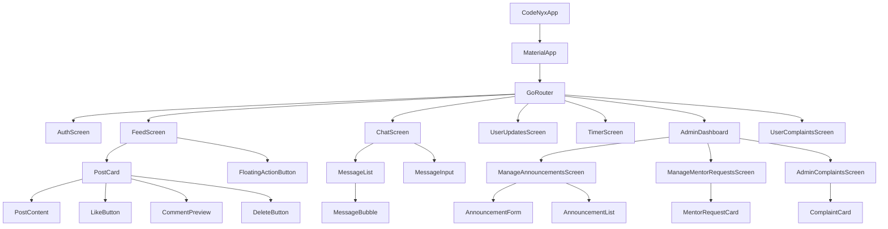

## Screen Component Flow

### 1. App Initialization Flow

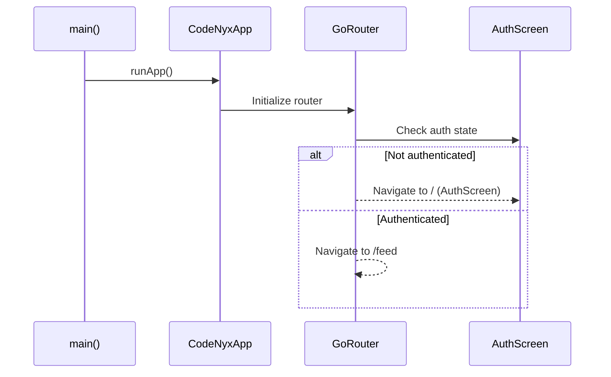

### 2. AuthScreen Component Flow

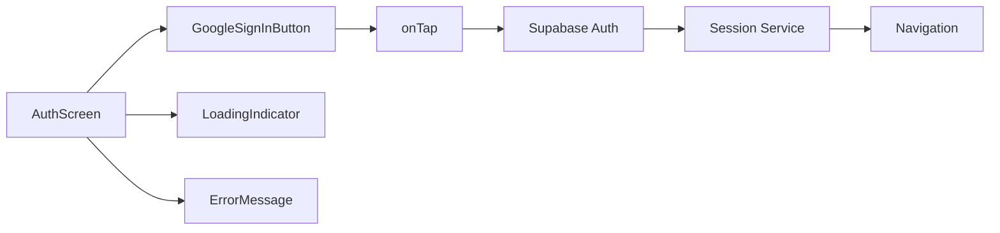

**Component Breakdown**:
- **AuthScreen**: Main authentication container
- **GoogleSignInButton**: Triggers OAuth flow
- **LoadingIndicator**: Shows during auth process
- **ErrorMessage**: Displays auth errors

### 3. FeedScreen Component Flow

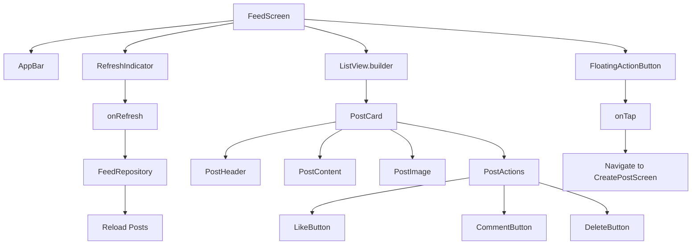

**Component Breakdown**:
- **FeedScreen**: Main feed container with scrollable list
- **AppBar**: Screen title and actions
- **RefreshIndicator**: Pull-to-refresh functionality
- **ListView.builder**: Efficient list rendering
- **PostCard**: Individual post display
- **FloatingActionButton**: Navigate to create post

**PostCard Sub-components**:
- **PostHeader**: User name and timestamp
- **PostContent**: Post text content
- **PostImage**: Post image (if any)
- **PostActions**: Like, comment, delete buttons

### 4. CreatePostScreen Component Flow

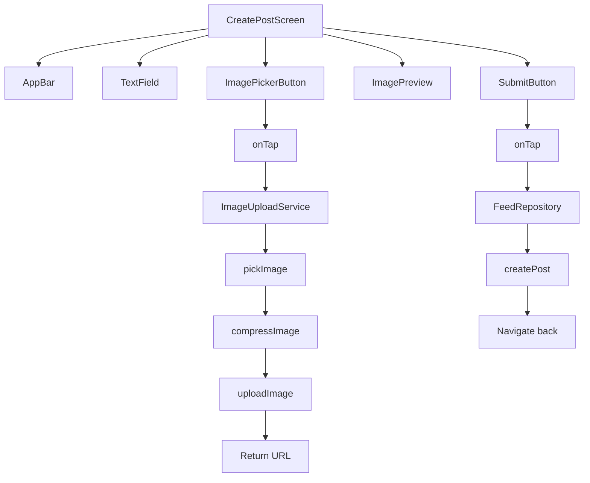

**Component Breakdown**:
- **CreatePostScreen**: Post creation form
- **TextField**: Multi-line text input
- **ImagePickerButton**: Trigger image selection
- **ImagePreview**: Show selected image
- **SubmitButton**: Submit post

### 5. PostDetailScreen Component Flow

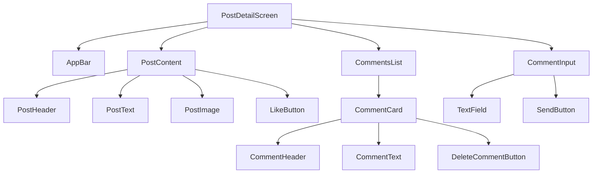

**Component Breakdown**:
- **PostDetailScreen**: Full post view
- **PostContent**: Post details
- **CommentsList**: Scrollable comments
- **CommentInput**: Add new comment

### 6. ChatScreen Component Flow

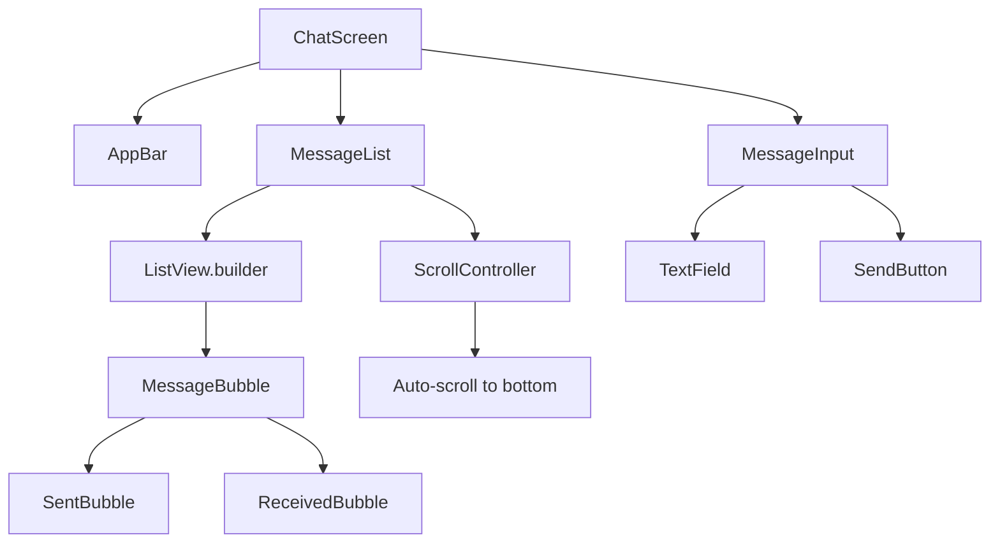

**Component Breakdown**:
- **ChatScreen**: Chat container
- **MessageList**: Scrollable message list
- **MessageBubble**: Individual message display
- **MessageInput**: Send new messages

**MessageBubble Variants**:
- **SentBubble**: User's own messages (right-aligned)
- **ReceivedBubble**: Others' messages (left-aligned)

### 7. UserUpdatesScreen Component Flow

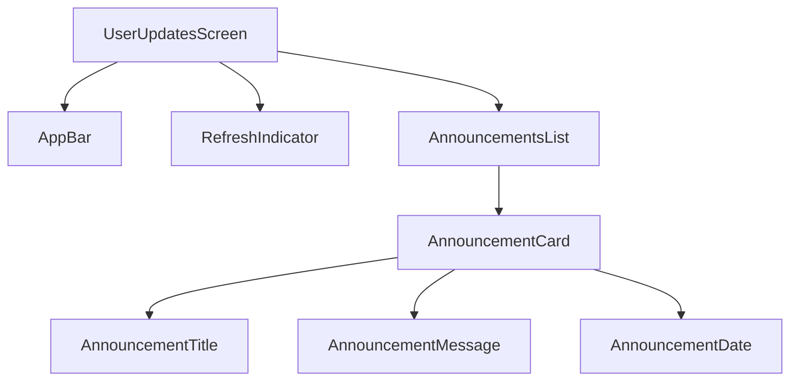

**Component Breakdown**:
- **UserUpdatesScreen**: Announcements view
- **AnnouncementsList**: Scrollable list
- **AnnouncementCard**: Individual announcement

### 8. Admin Screens Component Flow

#### ManageAnnouncementsScreen

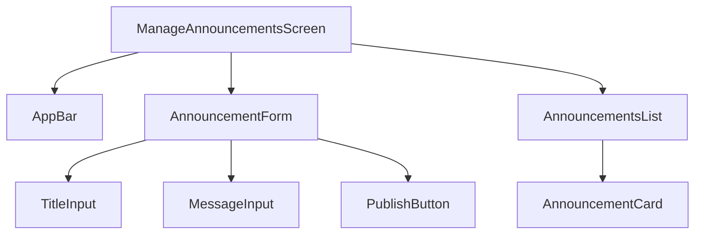

#### ManageMentorRequestsScreen

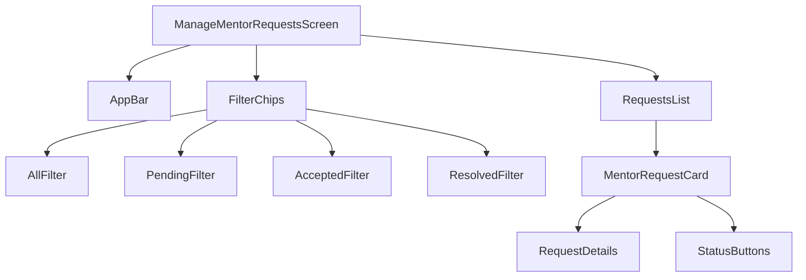

#### AdminComplaintsScreen

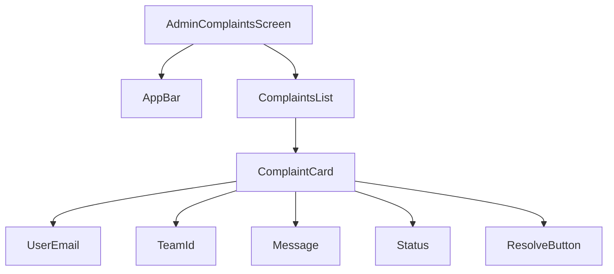

### 9. UserComplaintsScreen Component Flow

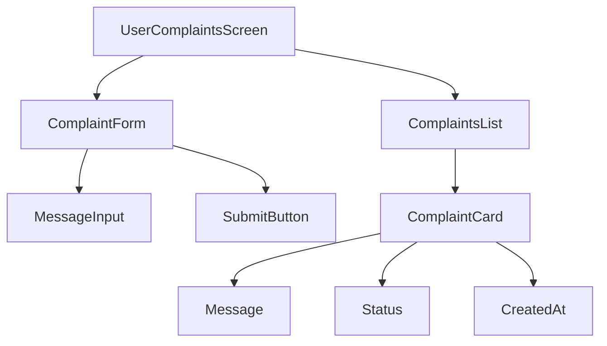

## Component Communication Patterns

### 1. Parent to Child Communication
**Pattern**: Pass data through constructor parameters

```dart
// Parent
PostCard(post: post, onLike: () => toggleLike(post.id))

// Child
class PostCard extends StatelessWidget {
  final Map<String, dynamic> post;
  final VoidCallback onLike;
}
```

### 2. Child to Parent Communication
**Pattern**: Callback functions

```dart
// Child
ElevatedButton(
  onPressed: widget.onLike,
  child: Text('Like'),
)

// Parent
PostCard(
  post: post,
  onLike: () => toggleLike(post.id),
)
```

### 3. Sibling Communication
**Pattern**: State lifted to parent or shared via Riverpod

```dart
// Via Riverpod
final postStateProvider = Provider<PostState>((ref) => PostState());

// Both siblings access same provider
final postState = ref.watch(postStateProvider);
```

### 4. Cross-Screen Communication
**Pattern**: Riverpod providers or navigation parameters

```dart
// Via Provider
final feedRepositoryProvider = Provider<FeedRepository>((ref) => FeedRepository());

// Via Navigation
context.push('/post-detail', extra: postId);
```

## Component Lifecycle Flow

### StatefulWidget Lifecycle

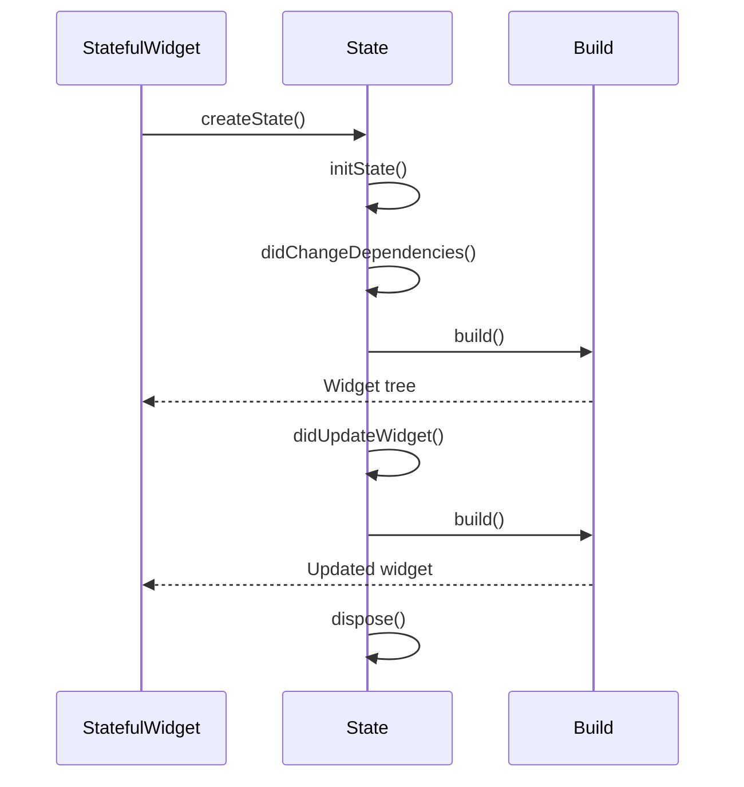

### Provider Lifecycle

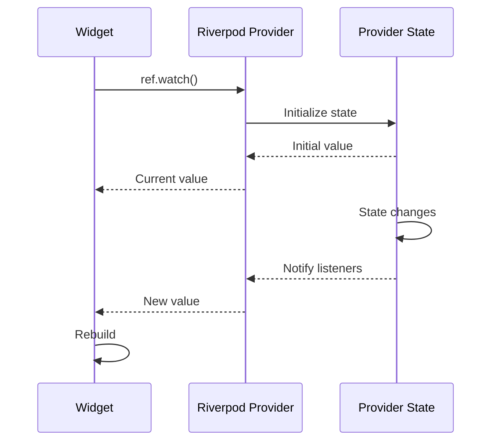

## Component Reusability

### Reusable Components

1. **PostCard**: Used in FeedScreen and PostDetailScreen
2. **MessageBubble**: Used for all chat messages
3. **AnnouncementCard**: Used in admin and user screens
4. **LoadingIndicator**: Reused across all screens
5. **ErrorDisplay**: Reused error handling component

### Component Composition

```dart
// Composing smaller components
PostCard(
  post: post,
  child: Column(
    children: [
      PostHeader(user: user),
      PostContent(text: text),
      PostImage(url: imageUrl),
      PostActions(
        onLike: onLike,
        onComment: onComment,
      ),
    ],
  ),
)
```

## Component State Management

### Local State
- **TextEditingController**: Form inputs
- **ScrollController**: Scroll position
- **AnimationController**: Animations
- **bool flags**: Loading states

### Global State
- **Riverpod Providers**: Shared state across screens
- **PostState**: Post like cache
- **SessionService**: User session data

## Component Performance Optimization

### 1. Const Constructors
```dart
const PostCard({required this.post}); // Compile-time constant
```

### 2. ListView.builder
```dart
ListView.builder(
  itemCount: posts.length,
  itemBuilder: (context, index) => PostCard(post: posts[index]),
)
```

### 3. RepaintBoundary
```dart
RepaintBoundary(
  child: PostCard(post: post),
)
```

## Component Testing Strategy

### Unit Tests
- Test individual widgets in isolation
- Mock providers and repositories
- Verify widget output

### Widget Tests
- Test widget interactions
- Test callback execution
- Verify state changes

### Integration Tests
- Test complete user flows
- Test navigation
- Test data persistence
