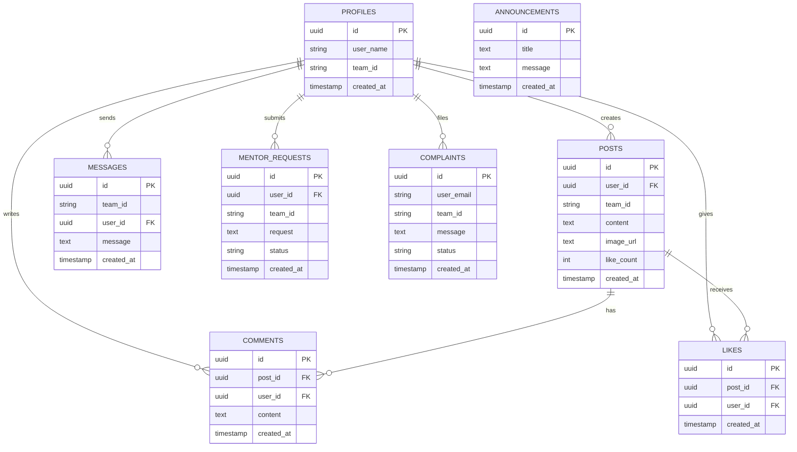

# Database Documentation

## Overview
CodeNyx uses Supabase (PostgreSQL) as its database. This document describes the database schema, relationships, and constraints.

## Database Schema

### Entity Relationship Diagram



## Table Definitions

### profiles

**Purpose**: Store user profile information and team assignments

**Columns**:
| Column | Type | Constraints | Description |
|--------|------|-------------|-------------|
| id | UUID | PK, NOT NULL | User ID (matches Supabase auth) |
| user_name | TEXT | NOT NULL | Display name of user |
| team_id | TEXT | | Team identifier |
| created_at | TIMESTAMPTZ | DEFAULT NOW() | Account creation timestamp |

**Indexes**:
- `profiles_pkey` on `id`
- `profiles_team_id_idx` on `team_id`

**RLS Policies**:
- Users can read their own profile
- Users can update their own profile
- Admins can read all profiles

### posts

**Purpose**: Store social feed posts

**Columns**:
| Column | Type | Constraints | Description |
|--------|------|-------------|-------------|
| id | UUID | PK, NOT NULL | Post ID |
| user_id | TEXT | NOT NULL, FK → profiles.id | Author ID |
| team_id | TEXT | NOT NULL | Team identifier |
| content | TEXT | NOT NULL | Post content |
| image_url | TEXT | | Image URL (optional) |
| like_count | INTEGER | DEFAULT 0 | Number of likes |
| created_at | TIMESTAMPTZ | DEFAULT NOW() | Creation timestamp |

**Indexes**:
- `posts_pkey` on `id`
- `posts_team_id_idx` on `team_id`
- `posts_created_at_idx` on `created_at`

**RLS Policies**:
- Users can read posts from their team
- Users can create posts for their team
- Users can delete their own posts
- Admins can read all posts

### comments

**Purpose**: Store comments on posts

**Columns**:
| Column | Type | Constraints | Description |
|--------|------|-------------|-------------|
| id | UUID | PK, NOT NULL | Comment ID |
| post_id | UUID | NOT NULL, FK → posts.id | Post ID |
| user_id | TEXT | NOT NULL, FK → profiles.id | Commenter ID |
| content | TEXT | NOT NULL | Comment content |
| created_at | TIMESTAMPTZ | DEFAULT NOW() | Creation timestamp |

**Indexes**:
- `comments_pkey` on `id`
- `comments_post_id_idx` on `post_id`
- `comments_created_at_idx` on `created_at`

**RLS Policies**:
- Users can read comments on posts from their team
- Users can create comments on posts from their team
- Users can delete their own comments
- Admins can read all comments

### likes

**Purpose**: Track post likes

**Columns**:
| Column | Type | Constraints | Description |
|--------|------|-------------|-------------|
| id | UUID | PK, NOT NULL | Like ID |
| post_id | UUID | NOT NULL, FK → posts.id | Post ID |
| user_id | TEXT | NOT NULL, FK → profiles.id | Liker ID |
| created_at | TIMESTAMPTZ | DEFAULT NOW() | Creation timestamp |

**Indexes**:
- `likes_pkey` on `id`
- `likes_post_id_idx` on `post_id`
- `likes_user_id_idx` on `user_id`
- `likes_post_user_idx` on `(post_id, user_id)` (unique)

**RLS Policies**:
- Users can read likes on posts from their team
- Users can create likes on posts from their team
- Users can delete their own likes
- Admins can read all likes

### messages

**Purpose**: Store team chat messages

**Columns**:
| Column | Type | Constraints | Description |
|--------|------|-------------|-------------|
| id | UUID | PK, NOT NULL | Message ID |
| team_id | TEXT | NOT NULL | Team identifier |
| user_id | TEXT | NOT NULL, FK → profiles.id | Sender ID |
| message | TEXT | NOT NULL | Message content |
| created_at | TIMESTAMPTZ | DEFAULT NOW() | Creation timestamp |

**Indexes**:
- `messages_pkey` on `id`
- `messages_team_id_idx` on `team_id`
- `messages_created_at_idx` on `created_at`

**RLS Policies**:
- Users can read messages from their team
- Users can create messages for their team
- Admins can read all messages

### announcements

**Purpose**: Store organizer announcements

**Columns**:
| Column | Type | Constraints | Description |
|--------|------|-------------|-------------|
| id | UUID | PK, NOT NULL | Announcement ID |
| title | TEXT | NOT NULL | Announcement title |
| message | TEXT | NOT NULL | Announcement content |
| created_at | TIMESTAMPTZ | DEFAULT NOW() | Creation timestamp |

**Indexes**:
- `announcements_pkey` on `id`
- `announcements_created_at_idx` on `created_at`

**RLS Policies**:
- All authenticated users can read announcements
- Only admins can create announcements
- Only admins can delete announcements

### mentor_requests

**Purpose**: Store mentorship requests

**Columns**:
| Column | Type | Constraints | Description |
|--------|------|-------------|-------------|
| id | UUID | PK, NOT NULL | Request ID |
| user_id | TEXT | NOT NULL, FK → profiles.id | Requester ID |
| team_id | TEXT | NOT NULL | Team identifier |
| request | TEXT | NOT NULL | Request details |
| status | TEXT | DEFAULT 'pending' | Status (pending, accepted, resolved) |
| created_at | TIMESTAMPTZ | DEFAULT NOW() | Creation timestamp |

**Indexes**:
- `mentor_requests_pkey` on `id`
- `mentor_requests_status_idx` on `status`
- `mentor_requests_created_at_idx` on `created_at`

**RLS Policies**:
- Users can read their own requests
- Users can create requests
- Admins can read all requests
- Admins can update request status

### complaints

**Purpose**: Store user complaints

**Columns**:
| Column | Type | Constraints | Description |
|--------|------|-------------|-------------|
| id | UUID | PK, NOT NULL | Complaint ID |
| user_email | TEXT | NOT NULL | Complainant email |
| team_id | TEXT | NOT NULL | Team identifier |
| message | TEXT | NOT NULL | Complaint content |
| status | TEXT | DEFAULT 'pending' | Status (pending, resolved) |
| created_at | TIMESTAMPTZ | DEFAULT NOW() | Creation timestamp |

**Indexes**:
- `complaints_pkey` on `id`
- `complaints_team_id_idx` on `team_id`
- `complaints_status_idx` on `status`
- `complaints_created_at_idx` on `created_at`

**RLS Policies**:
- Users can read complaints from their team
- Users can create complaints
- Admins can read all complaints
- Admins can update complaint status

## Database Relationships

### One-to-Many Relationships

1. **Profile → Posts**: One user can create many posts
2. **Profile → Comments**: One user can write many comments
3. **Profile → Likes**: One user can like many posts
4. **Profile → Messages**: One user can send many messages
5. **Profile → Mentor Requests**: One user can submit many requests
6. **Profile → Complaints**: One user can file many complaints
7. **Post → Comments**: One post can have many comments
8. **Post → Likes**: One post can receive many likes

### Many-to-One Relationships

1. **Posts → Profile**: Many posts belong to one user
2. **Comments → Post**: Many comments belong to one post
3. **Comments → Profile**: Many comments belong to one user
4. **Likes → Post**: Many likes belong to one post
5. **Likes → Profile**: Many likes belong to one user
6. **Messages → Profile**: Many messages belong to one user

## Database Constraints

### Primary Keys
All tables use UUID primary keys for distributed system compatibility.

### Foreign Keys
Foreign keys ensure referential integrity:
- `posts.user_id` → `profiles.id`
- `comments.post_id` → `posts.id`
- `comments.user_id` → `profiles.id`
- `likes.post_id` → `posts.id`
- `likes.user_id` → `profiles.id`
- `messages.user_id` → `profiles.id`
- `mentor_requests.user_id` → `profiles.id`
- `complaints.user_email` → (references auth.users.email)

### Unique Constraints
- `likes(post_id, user_id)`: Prevent duplicate likes

### Default Values
- `created_at`: Defaults to current timestamp
- `like_count`: Defaults to 0
- `status`: Defaults to 'pending'

## Database Functions

### increment_like_count

**Purpose**: Increment post like count atomically

```sql
CREATE OR REPLACE FUNCTION increment_like_count(post_id UUID)
RETURNS VOID AS $$
BEGIN
  UPDATE posts
  SET like_count = like_count + 1
  WHERE id = post_id;
END;
$$ LANGUAGE plpgsql;
```

### decrement_like_count

**Purpose**: Decrement post like count atomically

```sql
CREATE OR REPLACE FUNCTION decrement_like_count(post_id UUID)
RETURNS VOID AS $$
BEGIN
  UPDATE posts
  SET like_count = GREATEST(like_count - 1, 0)
  WHERE id = post_id;
END;
$$ LANGUAGE plpgsql;
```

## Database Triggers

### update_like_count_on_like_insert

**Purpose**: Auto-increment like count when like is added

```sql
CREATE TRIGGER update_like_count_on_like_insert
AFTER INSERT ON likes
FOR EACH ROW
EXECUTE FUNCTION increment_like_count(NEW.post_id);
```

### update_like_count_on_like_delete

**Purpose**: Auto-decrement like count when like is removed

```sql
CREATE TRIGGER update_like_count_on_like_delete
AFTER DELETE ON likes
FOR EACH ROW
EXECUTE FUNCTION decrement_like_count(OLD.post_id);
```

## Row Level Security (RLS) Policies

### Enable RLS
```sql
ALTER TABLE profiles ENABLE ROW LEVEL SECURITY;
ALTER TABLE posts ENABLE ROW LEVEL SECURITY;
ALTER TABLE comments ENABLE ROW LEVEL SECURITY;
ALTER TABLE likes ENABLE ROW LEVEL SECURITY;
ALTER TABLE messages ENABLE ROW LEVEL SECURITY;
ALTER TABLE announcements ENABLE ROW LEVEL SECURITY;
ALTER TABLE mentor_requests ENABLE ROW LEVEL SECURITY;
ALTER TABLE complaints ENABLE ROW LEVEL SECURITY;
```

### Example RLS Policy (posts)
```sql
-- Users can read posts from their team
CREATE POLICY "Users can read team posts"
ON posts FOR SELECT
USING (
  team_id IN (
    SELECT team_id FROM profiles WHERE id = auth.uid()
  )
);

-- Users can create posts for their team
CREATE POLICY "Users can create team posts"
ON posts FOR INSERT
WITH CHECK (
  team_id IN (
    SELECT team_id FROM profiles WHERE id = auth.uid()
  )
  AND user_id = auth.uid()
);

-- Users can delete their own posts
CREATE POLICY "Users can delete own posts"
ON posts FOR DELETE
USING (user_id = auth.uid());

-- Admins can read all posts
CREATE POLICY "Admins can read all posts"
ON posts FOR SELECT
USING (
  EXISTS (
    SELECT 1 FROM profiles
    WHERE id = auth.uid() AND is_admin = true
  )
);
```

## Database Optimization

### Indexes
Indexes are created on:
- All foreign keys
- Frequently queried columns (team_id, created_at, status)
- Composite indexes for common query patterns

### Query Optimization Tips
1. Use `select()` to fetch only needed columns
2. Use `eq()` for exact matches
3. Use `order()` with indexed columns
4. Use `range()` for pagination
5. Avoid `*` in production queries

### Connection Pooling
Supabase manages connection pooling automatically. Connection limits:
- Free tier: 60 connections
- Pro tier: 500 connections

## Database Backup

Supabase provides:
- **Daily backups**: Automatic daily backups
- **Point-in-time recovery**: Recover to any point in time
- **Physical backups**: Full database snapshots

## Database Migration

Supabase supports:
- **SQL migrations**: Write SQL for schema changes
- **Schema diff**: Compare schema versions
- **Rollback**: Revert to previous schema

## Database Monitoring

Supabase dashboard provides:
- **Query performance**: Slow query detection
- **Connection usage**: Active connections
- **Storage usage**: Database size
- **Replication lag**: For read replicas

## Database Security

### Security Features
1. **RLS**: Row-level security for all tables
2. **Encryption**: Data encrypted at rest and in transit
3. **Authentication**: Integrated with Supabase Auth
4. **API Keys**: Separate anon and service role keys
5. **Network restrictions**: IP whitelist available

### Best Practices
1. Never expose service role key in client code
2. Use RLS policies instead of app-level checks
3. Validate input before database operations
4. Use prepared statements (Supabase does this automatically)
5. Regularly review and update RLS policies
