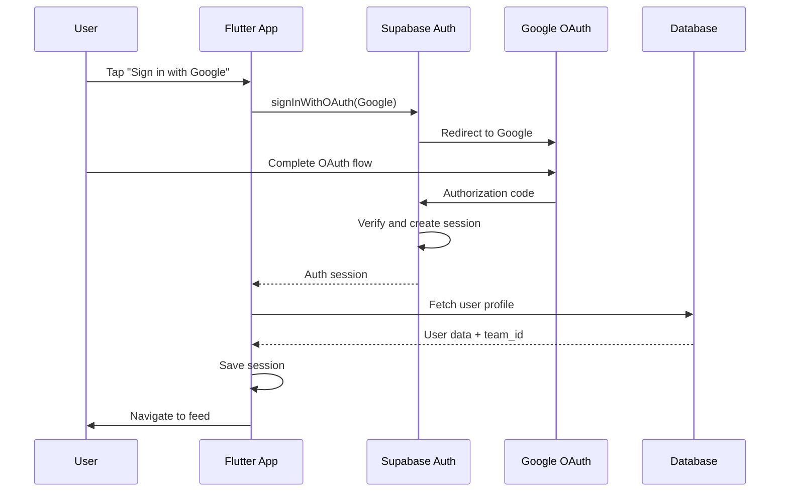
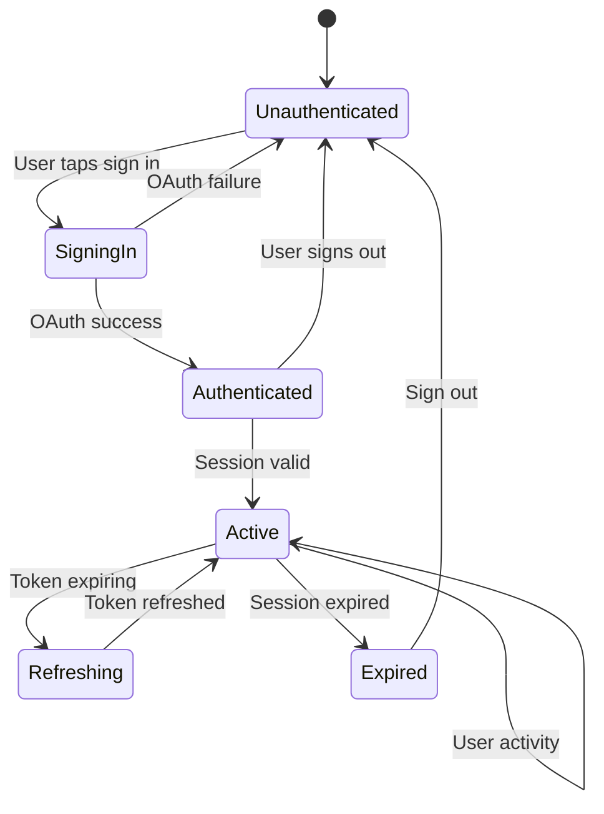

# Authentication

## Overview
CodeNyx uses Supabase Authentication with Google OAuth for user authentication. This document explains the authentication flow, security measures, and session management.

## Authentication Flow



## Authentication Implementation

### Initialization

**Location**: `lib/main.dart`

```dart
void main() async {
  WidgetsFlutterBinding.ensureInitialized();
  
  await Supabase.initialize(
    url: const String.fromEnvironment('SUPABASE_URL'),
    anonKey: const String.fromEnvironment('SUPABASE_ANON_KEY'),
  );
  
  runApp(const CodeNyxApp());
}
```

### Google OAuth Sign-In

**Location**: `lib/features/auth/auth_screen.dart`

```dart
Future<void> _signInWithGoogle() async {
  try {
    await Supabase.instance.client.auth.signInWithOAuth(
      OAuthProvider.google,
      redirectTo: kIsWeb 
        ? null 
        : 'io.supabase.codenyx://auth/callback',
    );
  } catch (e) {
    _showError('Sign in failed: $e');
  }
}
```

### Deep Link Configuration

**Android**: `android/app/src/main/AndroidManifest.xml`

```xml
<intent-filter>
  <action android:name="android.intent.action.VIEW" />
  <category android:name="android.intent.category.DEFAULT" />
  <category android:name="android.intent.category.BROWSABLE" />
  <data
    android:scheme="io.supabase.codenyx"
    android:host="auth/callback" />
</intent-filter>
```

**iOS**: `ios/Runner/Info.plist`

```xml
<key>CFBundleURLTypes</key>
<array>
  <dict>
    <key>CFBundleTypeRole</key>
    <string>Editor</string>
    <key>CFBundleURLName</key>
    <string>io.supabase.codenyx</string>
    <key>CFBundleURLSchemes</key>
    <array>
      <string>io.supabase.codenyx</string>
    </array>
  </dict>
</array>
```

## Session Management

### Session Storage

**Location**: `lib/services/session_service.dart`

```dart
class SessionService {
  static const _sessionKey = 'user_session';
  
  static Future<void> saveSession(Map<String, dynamic> session) async {
    final prefs = await SharedPreferences.getInstance();
    await prefs.setString(_sessionKey, jsonEncode(session));
  }
  
  static Future<Map<String, dynamic>> getSession() async {
    final prefs = await SharedPreferences.getInstance();
    final sessionJson = prefs.getString(_sessionKey);
    if (sessionJson != null) {
      return jsonDecode(sessionJson);
    }
    return {};
  }
  
  static Future<void> clearSession() async {
    final prefs = await SharedPreferences.getInstance();
    await prefs.remove(_sessionKey);
  }
}
```

### Session Data Structure

```dart
{
  'user_id': 'uuid',
  'user_email': 'user@example.com',
  'user_name': 'John Doe',
  'team_id': 'TEAM123',
  'is_admin': false,
}
```

### Session Lifecycle



## Authentication State Monitoring

### Auth State Changes

```dart
// Listen to auth state changes
Supabase.instance.client.auth.onAuthStateChange.listen((data) {
  final AuthChangeEvent event = data.event;
  final Session? session = data.session;
  
  switch (event) {
    case AuthChangeEvent.signedIn:
      // Handle sign in
      break;
    case AuthChangeEvent.signedOut:
      // Handle sign out
      break;
    case AuthChangeEvent.tokenRefreshed:
      // Handle token refresh
      break;
    case AuthChangeEvent.userUpdated:
      // Handle user update
      break;
  }
});
```

### Current User Access

```dart
final user = Supabase.instance.client.auth.currentUser;
if (user != null) {
  final email = user.email;
  final id = user.id;
  final metadata = user.userMetadata;
}
```

## Sign Out

### Implementation

```dart
Future<void> _signOut() async {
  try {
    await Supabase.instance.client.auth.signOut();
    await SessionService.clearSession();
    // Navigate to auth screen
  } catch (e) {
    _showError('Sign out failed: $e');
  }
}
```

## Security Measures

### 1. Token Management

**Access Token**: Short-lived (1 hour)
**Refresh Token**: Long-lived (30 days)
**Automatic Refresh**: Supabase handles token refresh automatically

### 2. Row Level Security (RLS)

All database tables have RLS policies that check `auth.uid()`:

```sql
-- Example: Users can only see their team's posts
CREATE POLICY "Users can read team posts"
ON posts FOR SELECT
USING (
  team_id IN (
    SELECT team_id FROM profiles WHERE id = auth.uid()
  )
);
```

### 3. Team-Based Access

Users are assigned to teams, and all data is filtered by `team_id`:

```dart
final session = await SessionService.getSession();
final teamId = session['teamId'];

final posts = await client
    .from('posts')
    .select()
    .eq('team_id', teamId);
```

### 4. Admin Role Check

Admin screens check for admin role:

```dart
final session = await SessionService.getSession();
final isAdmin = session['isAdmin'] ?? false;

if (!isAdmin) {
  _showError('Access denied');
  return;
}
```

### 5. Secure Storage

Session data stored in SharedPreferences (encrypted on supported devices)

### 6. HTTPS Only

All API calls use HTTPS (enforced by Supabase)

### 7. Environment Variables

Sensitive credentials stored in environment variables:

```dart
const supabaseUrl = String.fromEnvironment('SUPABASE_URL');
const supabaseAnonKey = String.fromEnvironment('SUPABASE_ANON_KEY');
```

## Authentication Error Handling

### Common Errors

| Error | Cause | Solution |
|-------|-------|----------|
| `AuthApiException` | Invalid credentials | Guide user to retry |
| `NetworkError` | No internet | Show network error |
| `OAuthError` | OAuth denied | Show OAuth error |
| `SessionExpired` | Token expired | Auto-refresh or re-auth |

### Error Handling Pattern

```dart
try {
  await Supabase.instance.client.auth.signInWithOAuth(
    OAuthProvider.google,
  );
} on AuthApiException catch (e) {
  _showError('Authentication error: ${e.message}');
} catch (e) {
  _showError('Unexpected error: $e');
}
```

## Authentication Best Practices

1. **Never store credentials in code**: Use environment variables
2. **Use RLS policies**: Enforce security at database level
3. **Implement proper logout**: Clear session and sign out
4. **Handle token refresh**: Supabase handles this automatically
5. **Validate session**: Check session validity before API calls
6. **Use secure storage**: Encrypt sensitive data on device
7. **Implement rate limiting**: Prevent brute force attacks
8. **Log authentication events**: Monitor for suspicious activity

## Multi-Device Support

### Session Sync

Supabase Auth supports multiple devices:
- Each device gets its own session
- Same user can be logged in on multiple devices
- Sign out on one device doesn't affect others

### Session Persistence

Sessions persist across app restarts:
- Access token stored in secure storage
- Refresh token stored in secure storage
- Session restored on app launch

## Testing Authentication

### Unit Tests

```dart
test('sign in with google', () async {
  // Mock Supabase auth
  when(mockAuth.signInWithOAuth(any))
      .thenAnswer((_) async => mockSession);
  
  await authScreen._signInWithGoogle();
  
  verify(mockAuth.signInWithOAuth(OAuthProvider.google));
});
```

### Integration Tests

```dart
testWidgets('authentication flow', (tester) async {
  await tester.pumpWidget(MyApp());
  
  // Tap sign in button
  await tester.tap(find.text('Sign in with Google'));
  await tester.pumpAndSettle();
  
  // Verify navigation to feed
  expect(find.text('Social Feed'), findsOneWidget);
});
```

## Troubleshooting

### OAuth Redirect Issues

**Problem**: OAuth redirect fails
**Solution**: 
- Verify deep link configuration
- Check custom scheme matches
- Test with `supabase auth link` command

### Session Not Persisting

**Problem**: Session lost on app restart
**Solution**:
- Verify SharedPreferences is working
- Check session save/load logic
- Ensure no errors in session service

### RLS Policy Blocking Access

**Problem**: User can't access data
**Solution**:
- Check RLS policy logic
- Verify `auth.uid()` is set
- Check user profile exists in database

### Token Refresh Failing

**Problem**: Token refresh fails
**Solution**:
- Check refresh token validity
- Verify network connection
- Check Supabase auth settings
