# Sequence Diagrams

## Overview
This document contains Mermaid sequence diagrams illustrating key interactions within the CodeNyx application.

## Authentication Flow

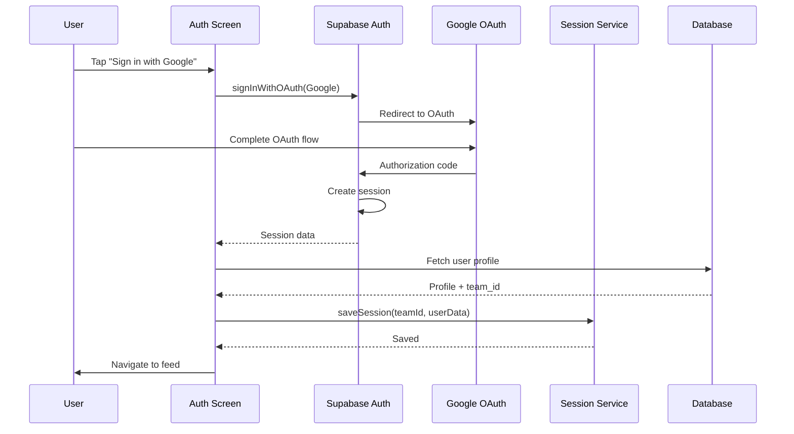

## Create Post Flow

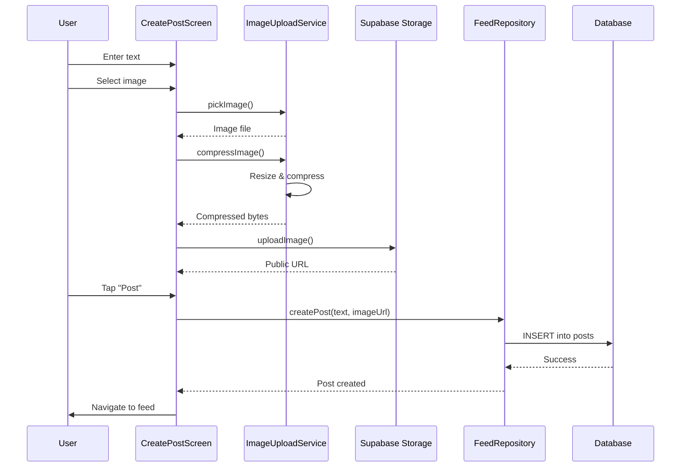

## Load Feed Flow

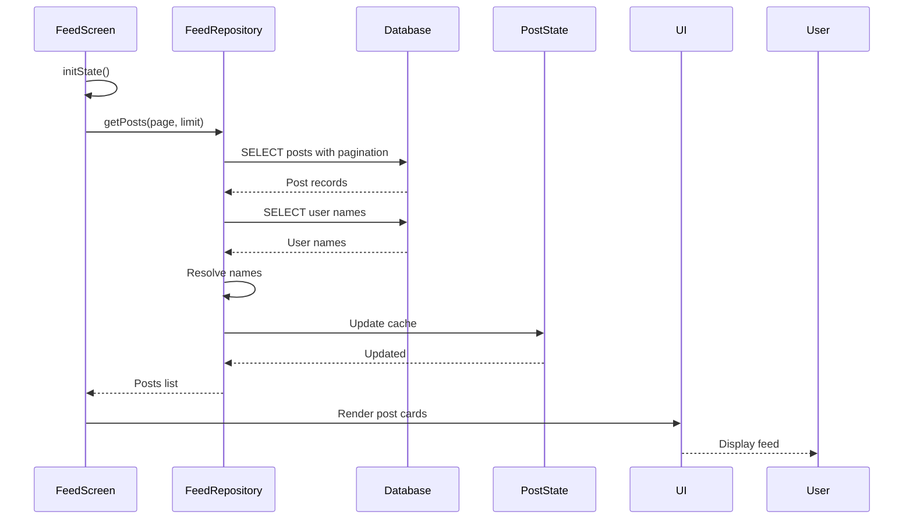

## Like Post Flow

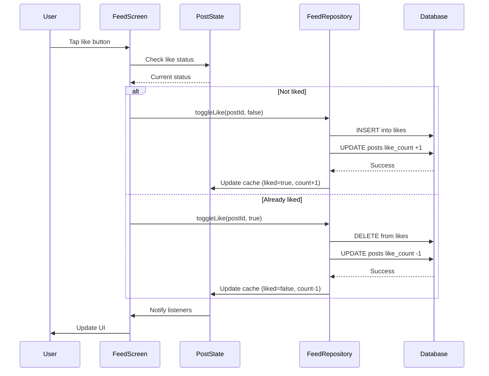

## Send Chat Message Flow

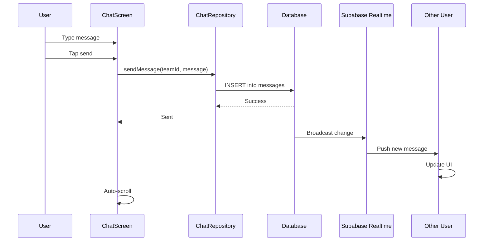

## Receive Real-time Message Flow

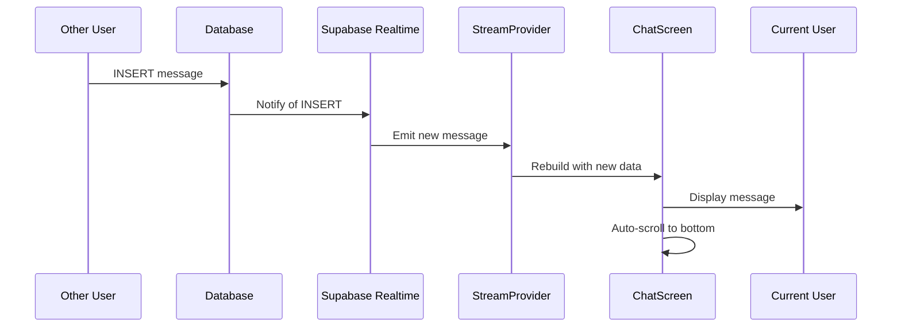

## Create Announcement Flow (Admin)

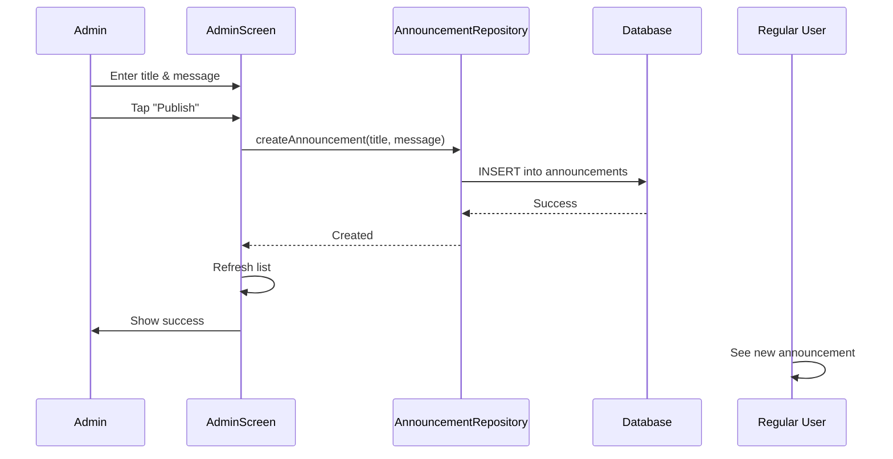

## Submit Complaint Flow

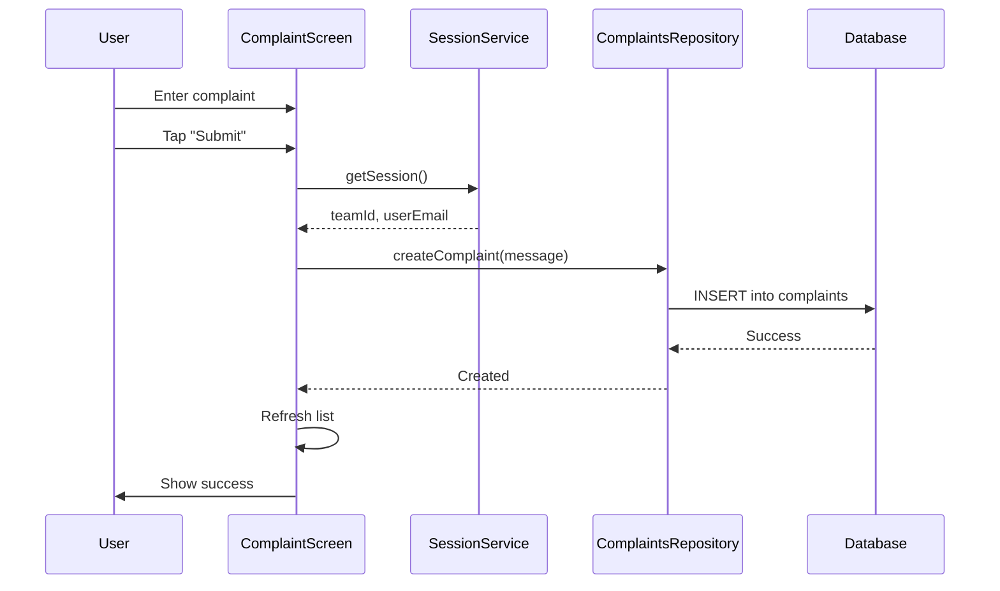

## Resolve Complaint Flow (Admin)

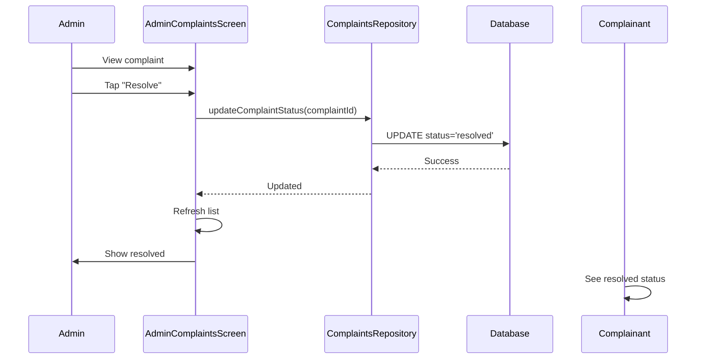

## Navigation Flow

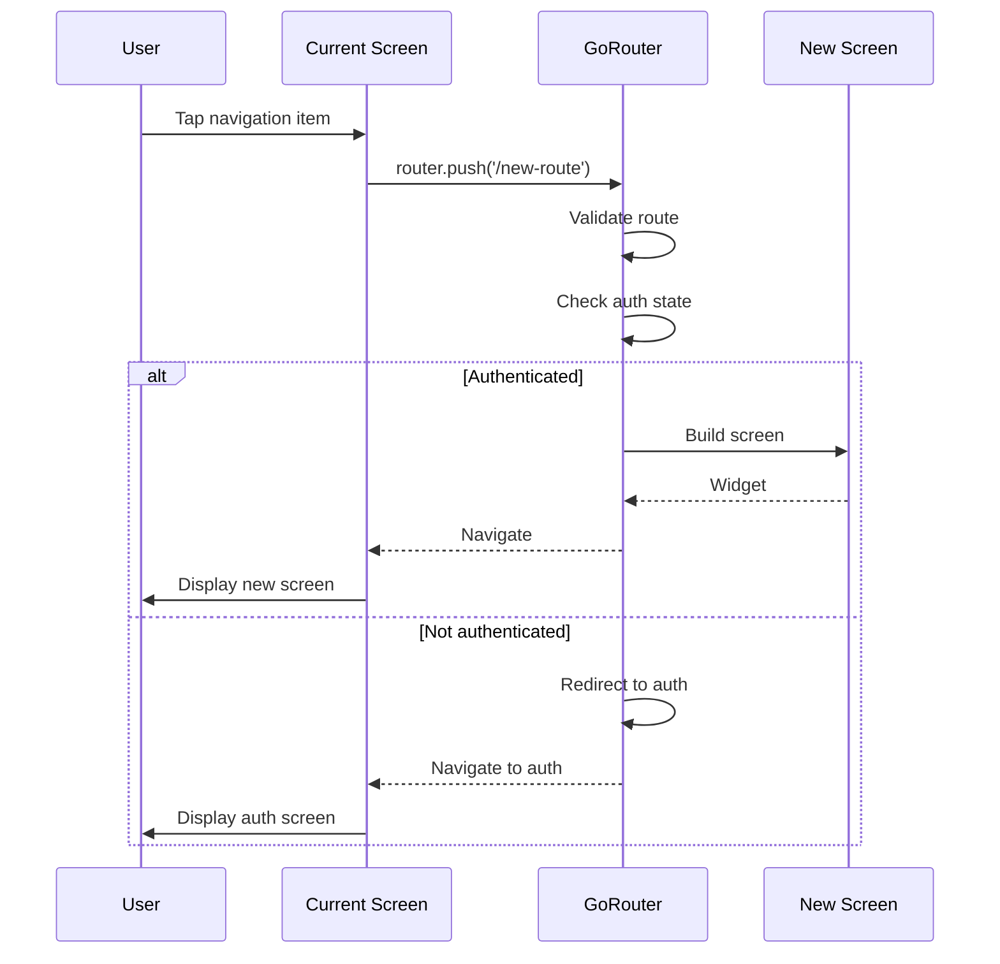

## Error Handling Flow

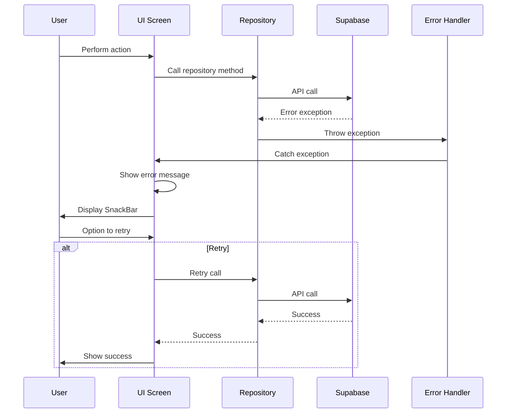

## Session Refresh Flow

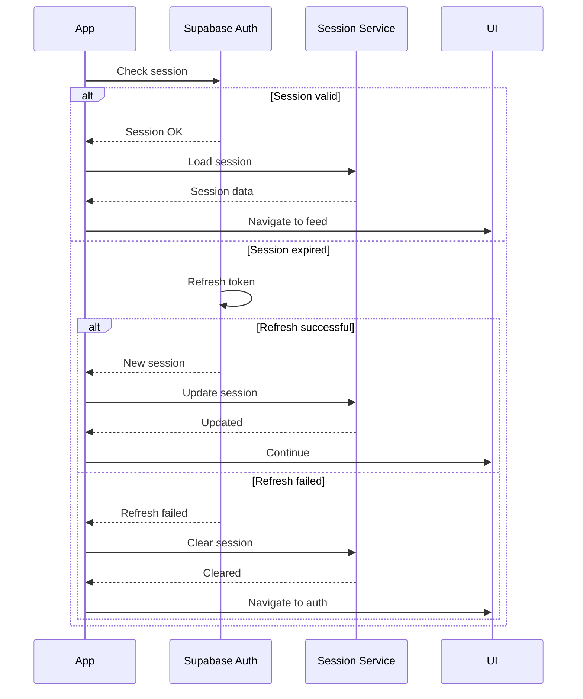

## Image Upload Flow

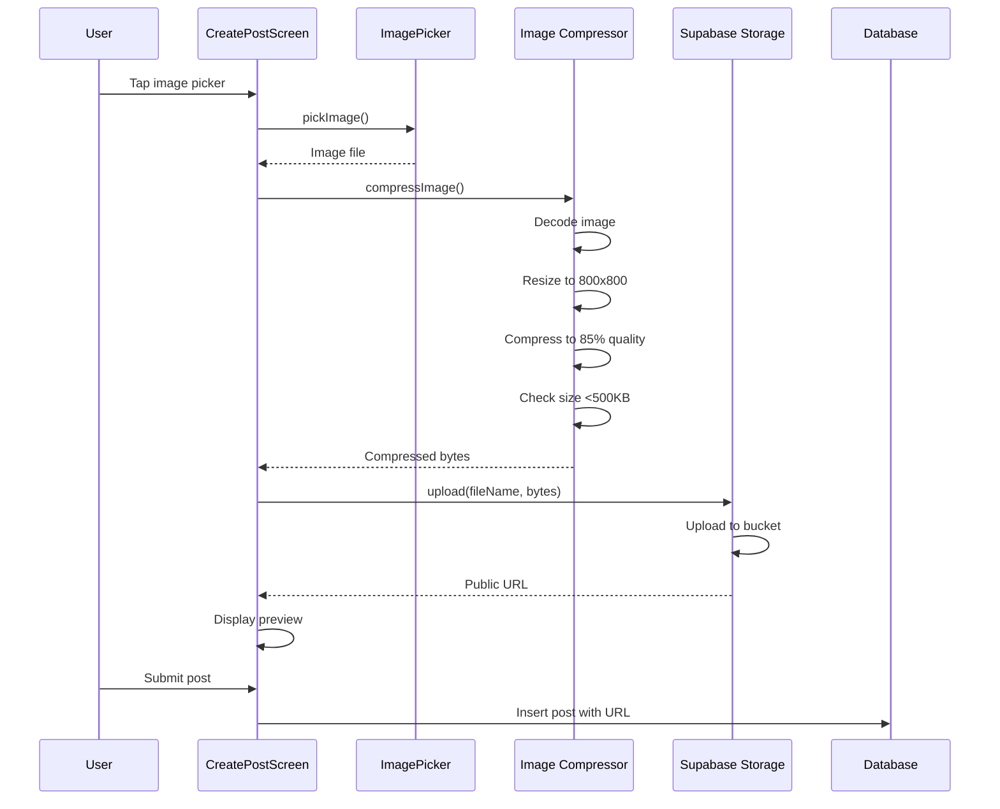

## Pull-to-Refresh Flow

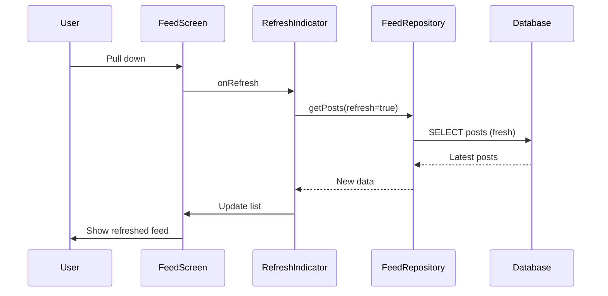

## Pagination Flow

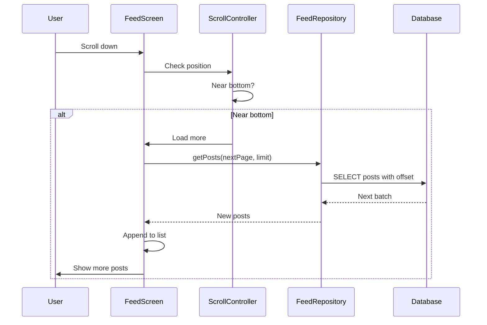

## Sign Out Flow

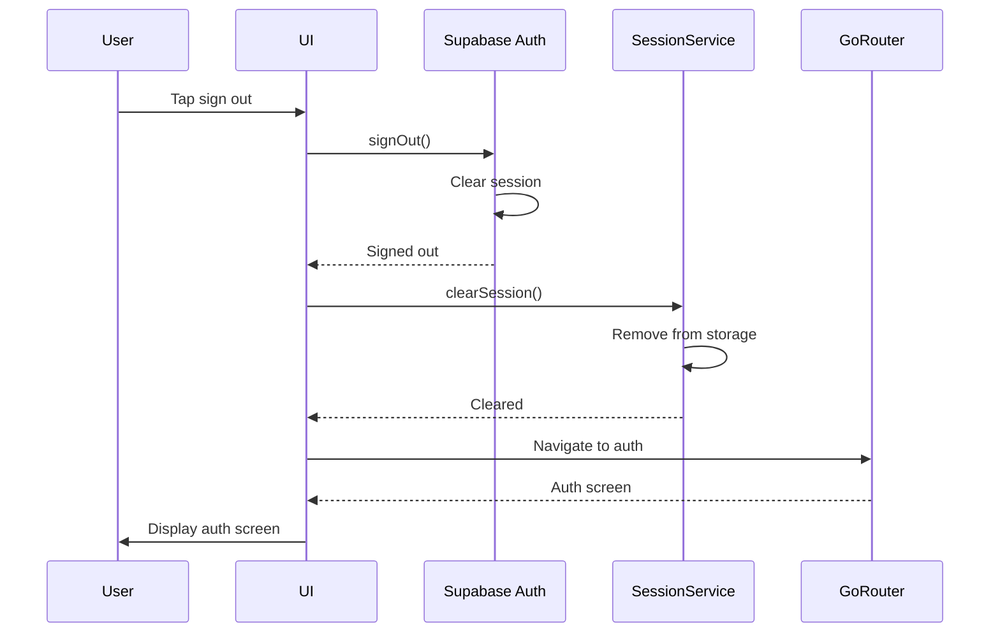
