# Flowcharts

## Overview
This document contains Mermaid flowcharts illustrating key processes and decision flows in the CodeNyx application.

## App Startup Flow

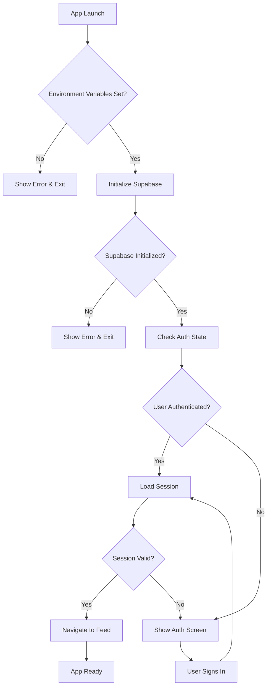

## Authentication Flow

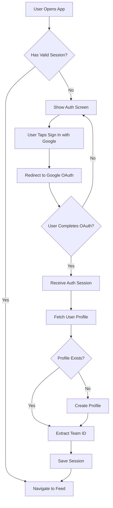

## Create Post Flow

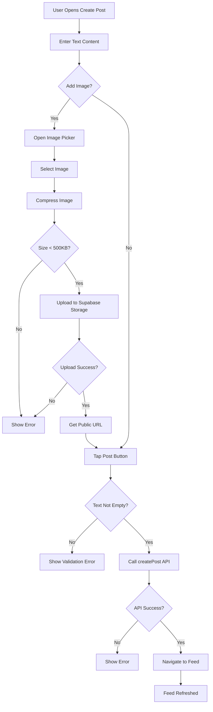

## Like Post Flow

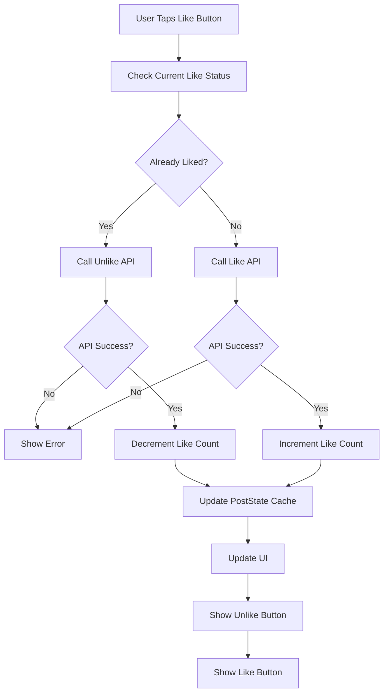

## Send Chat Message Flow

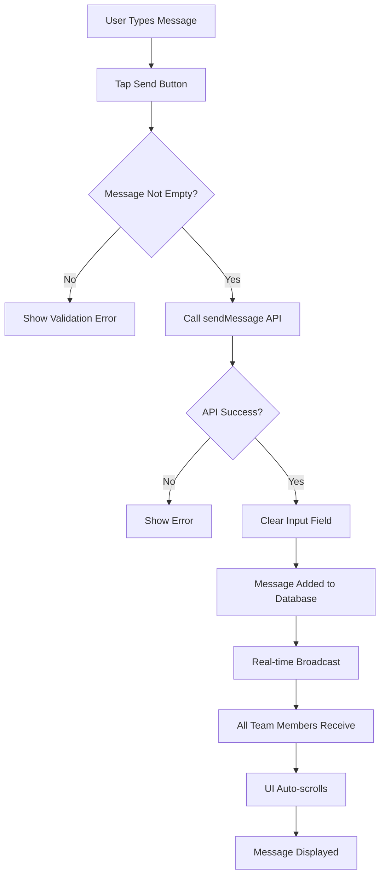

## Admin Create Announcement Flow

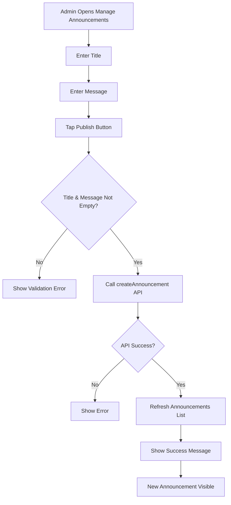

## Submit Complaint Flow

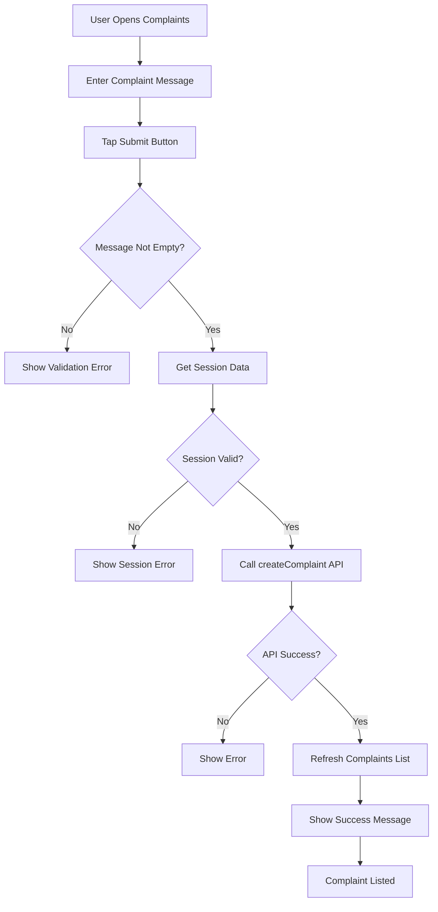

## Admin Resolve Complaint Flow

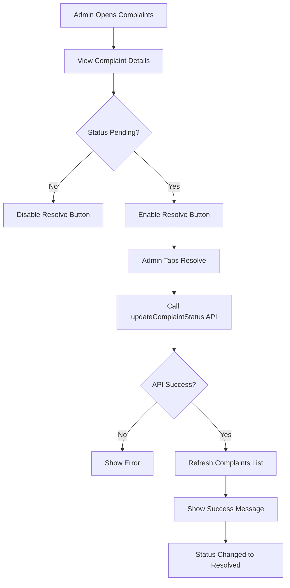

## Image Upload Flow

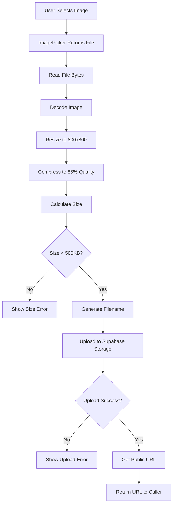

## Error Handling Flow

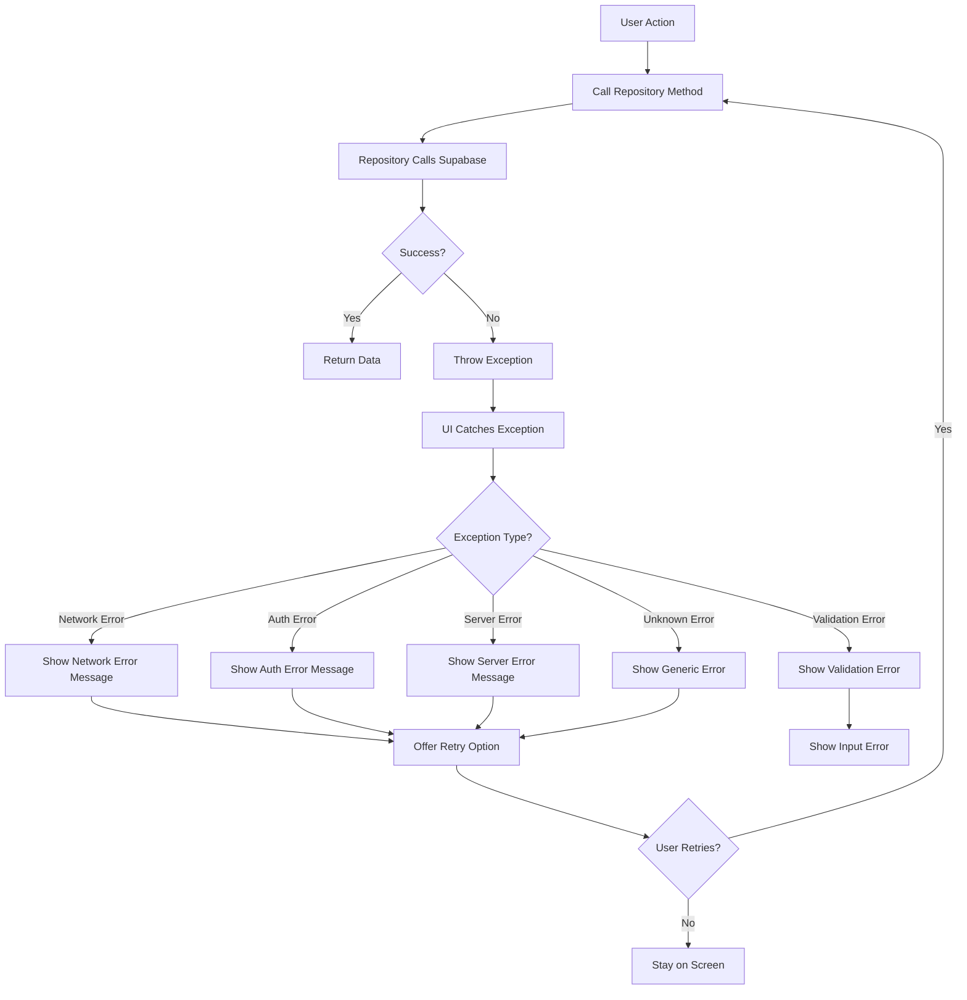

## Navigation Flow

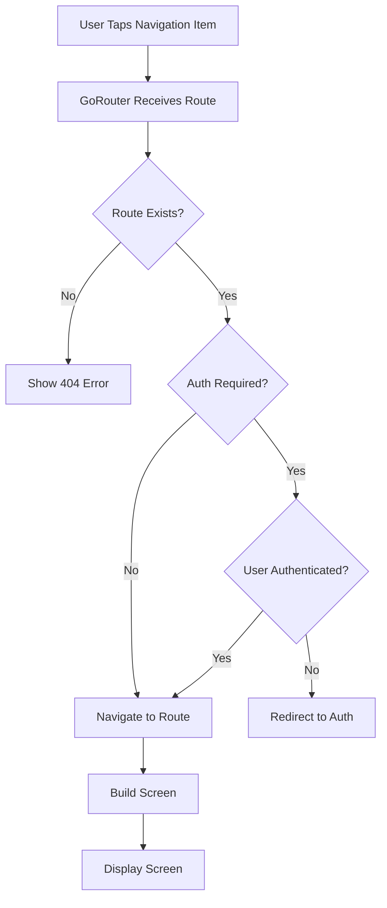

## Session Management Flow

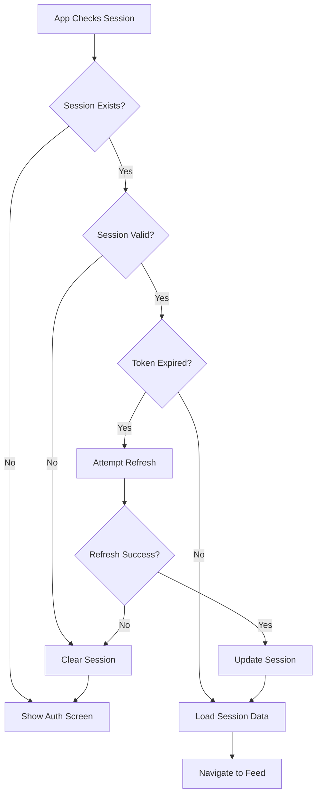

## Pull-to-Refresh Flow

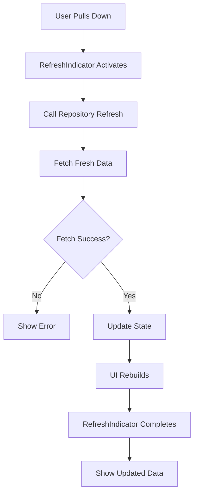

## Pagination Flow

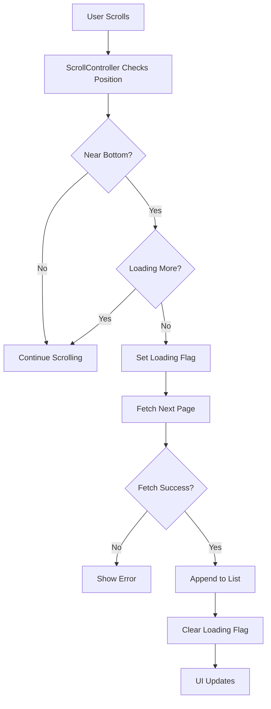

## Sign Out Flow

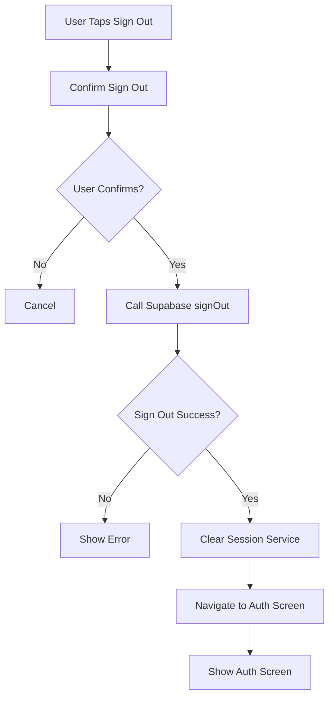

## Data Validation Flow

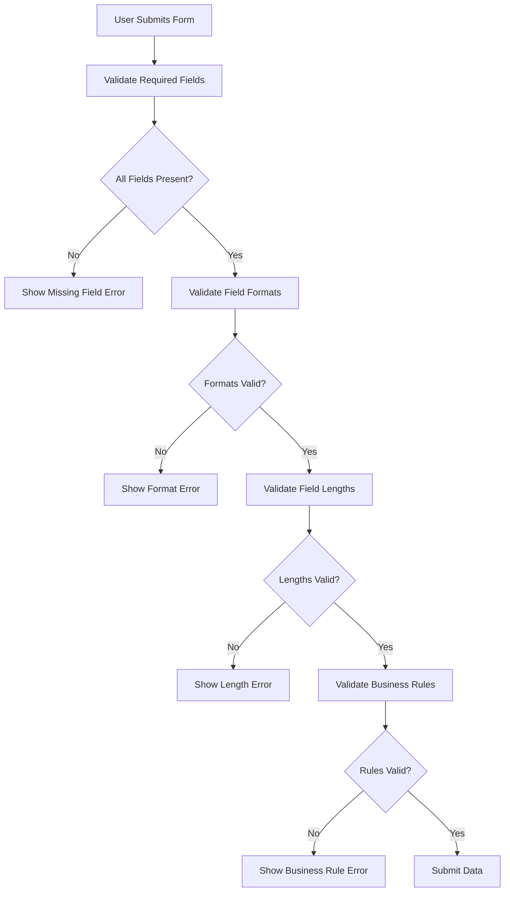

## Real-time Subscription Flow

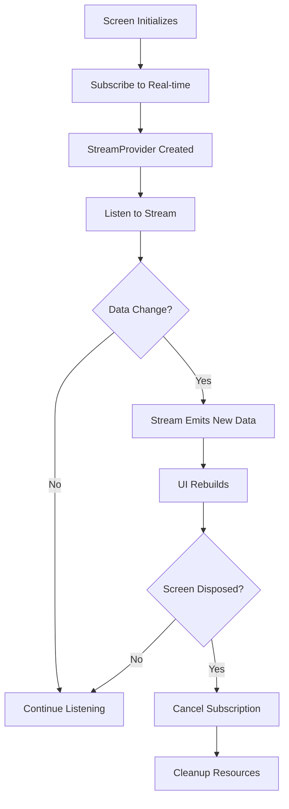
