# Class Diagrams

## Overview
This document contains Mermaid class diagrams illustrating the structure and relationships of classes in the CodeNyx application.

## Core Classes

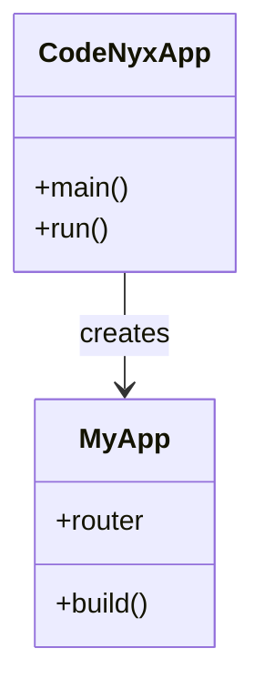

## Theme Classes

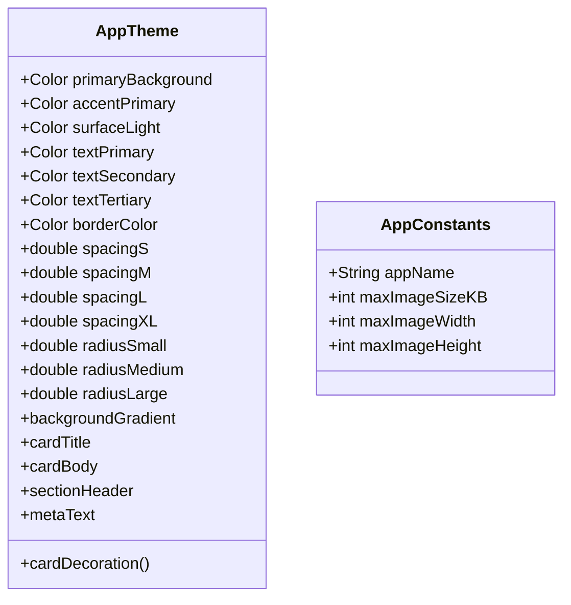

## Service Classes

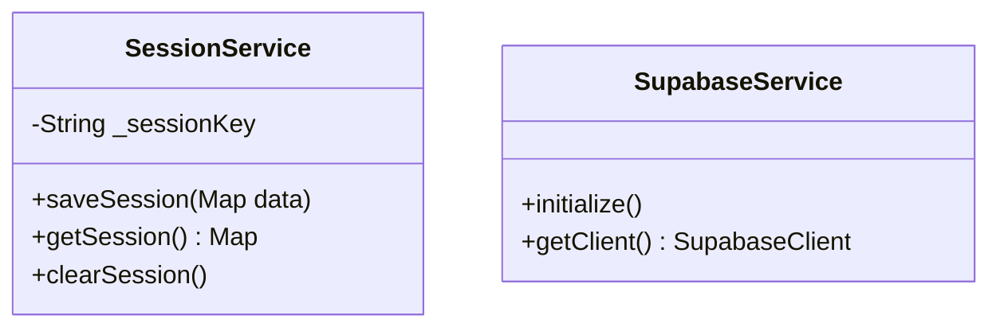

## Social Feed Classes

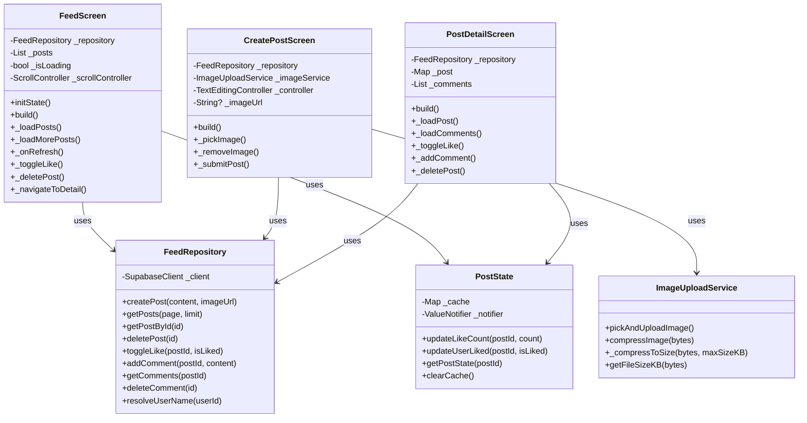

## Chat Classes

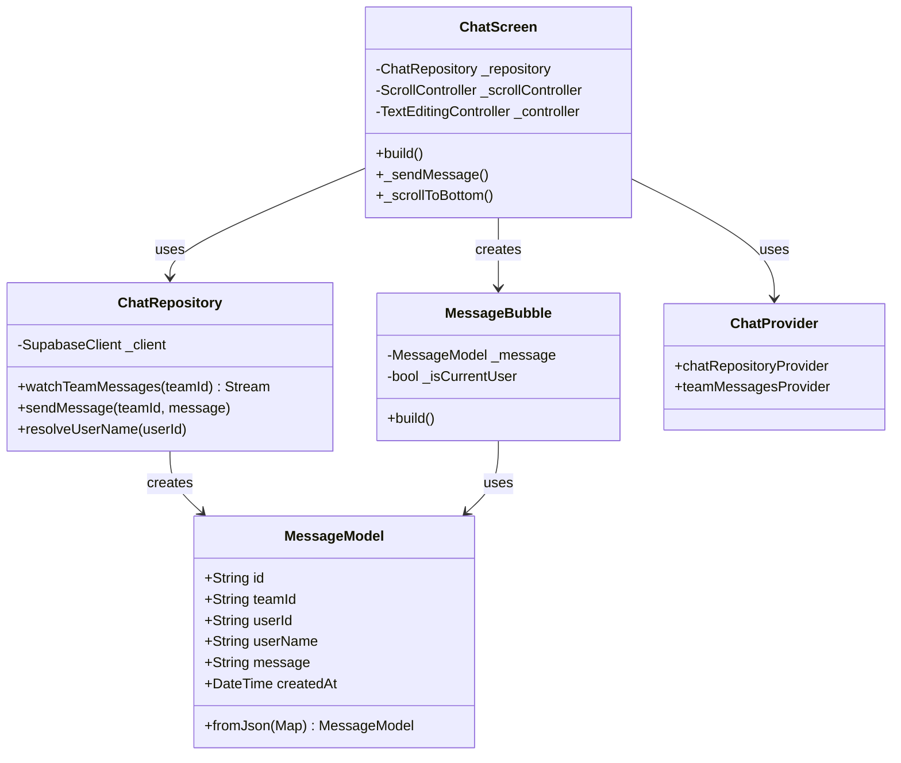

## User Classes

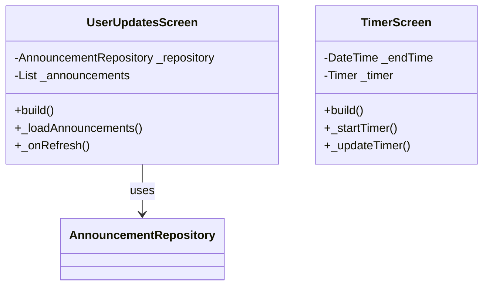

## Admin Classes

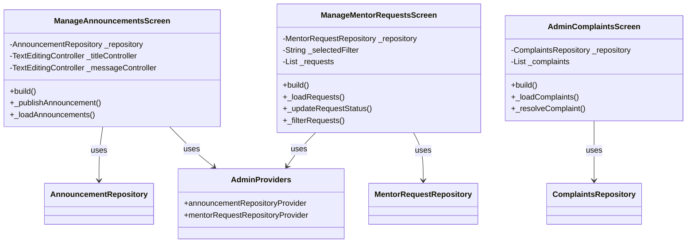

## Complaints Classes

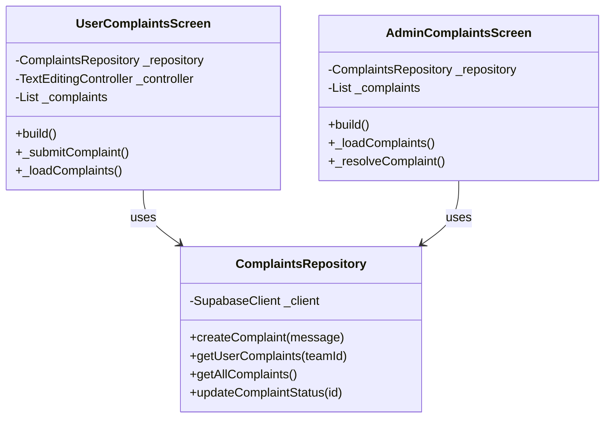

## Repository Pattern

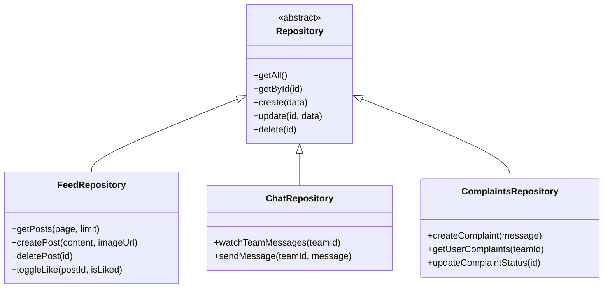

## Provider Pattern

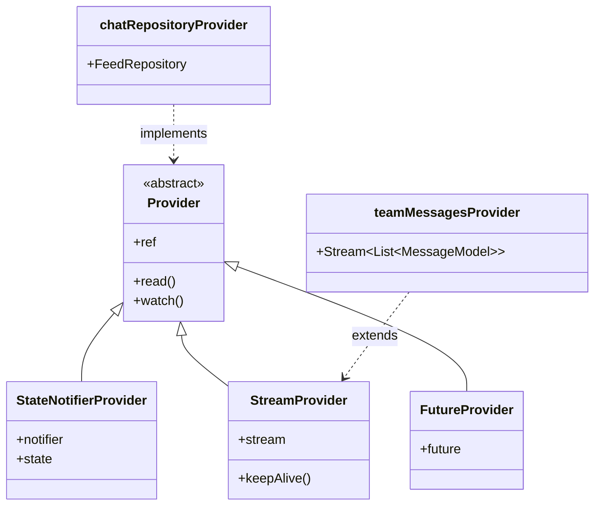

## Model Classes

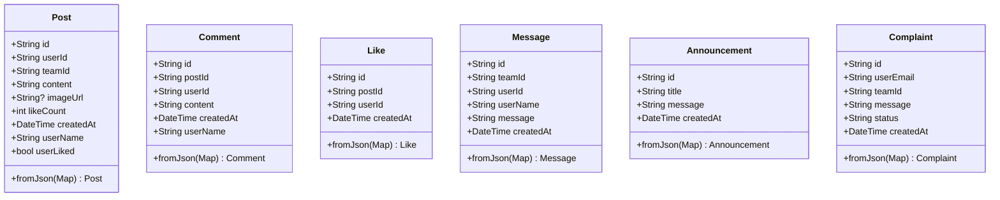

## Widget Hierarchy

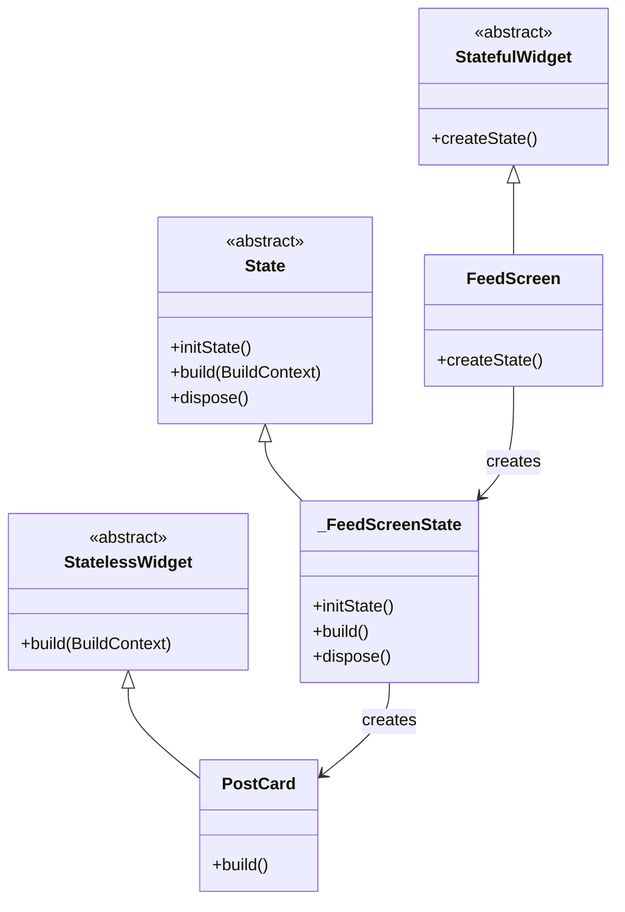

## Data Flow Classes

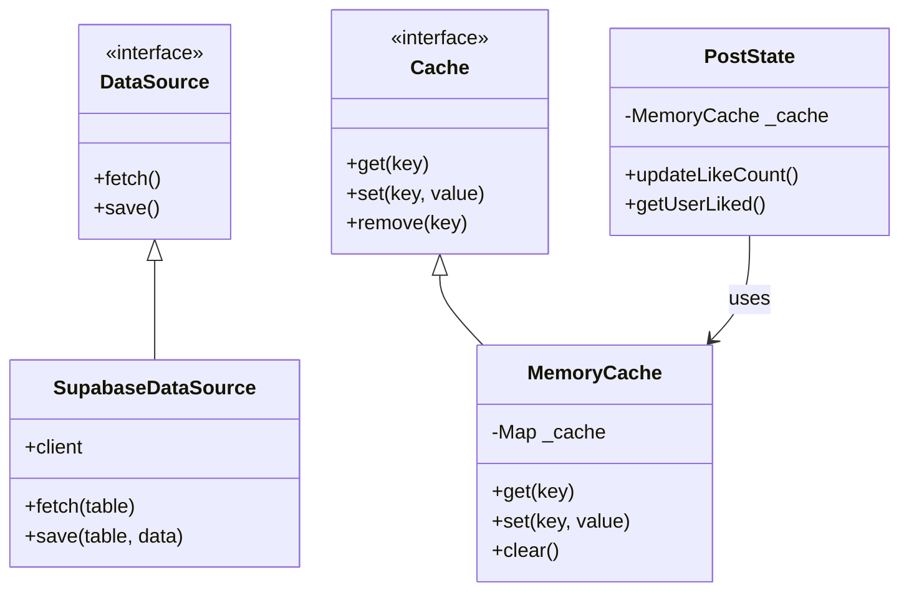

## Authentication Classes

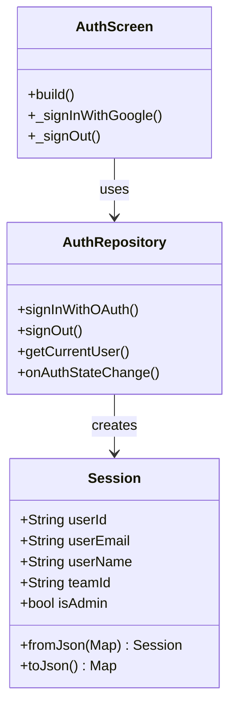

## Error Handling Classes

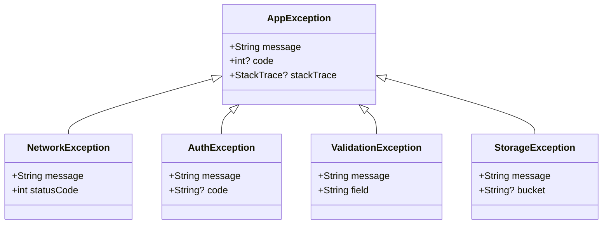
