# Architecture Diagrams

## Overview
This document contains Mermaid architecture diagrams illustrating the overall system architecture of the CodeNyx application.

## High-Level Architecture

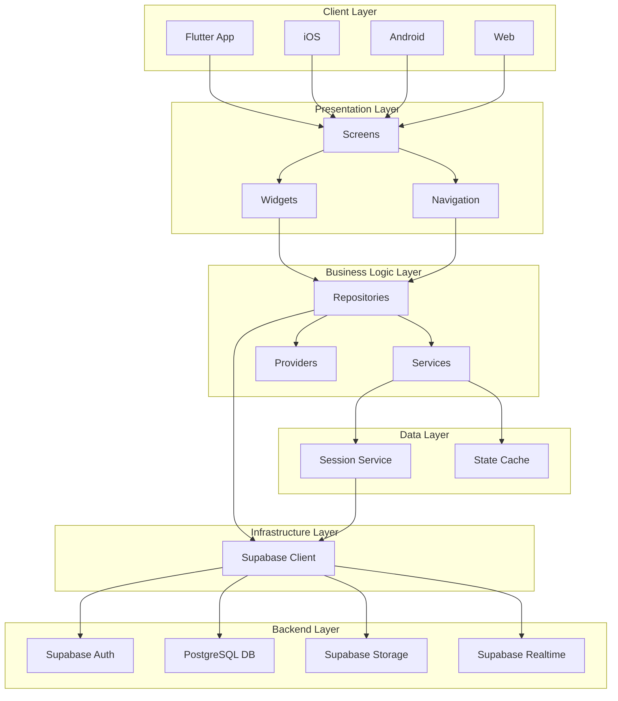

## Layered Architecture

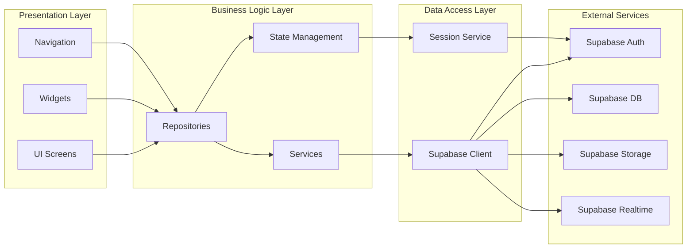

## Feature Architecture

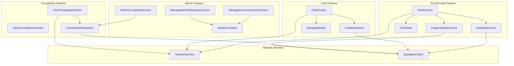

## Data Architecture

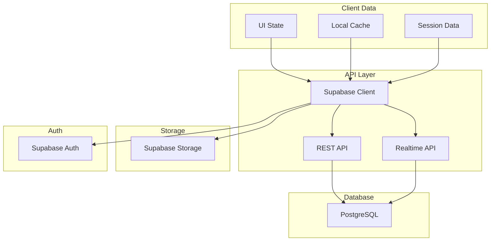

## Component Architecture

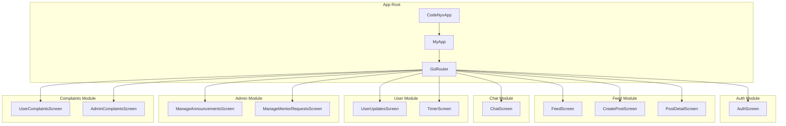

## State Management Architecture

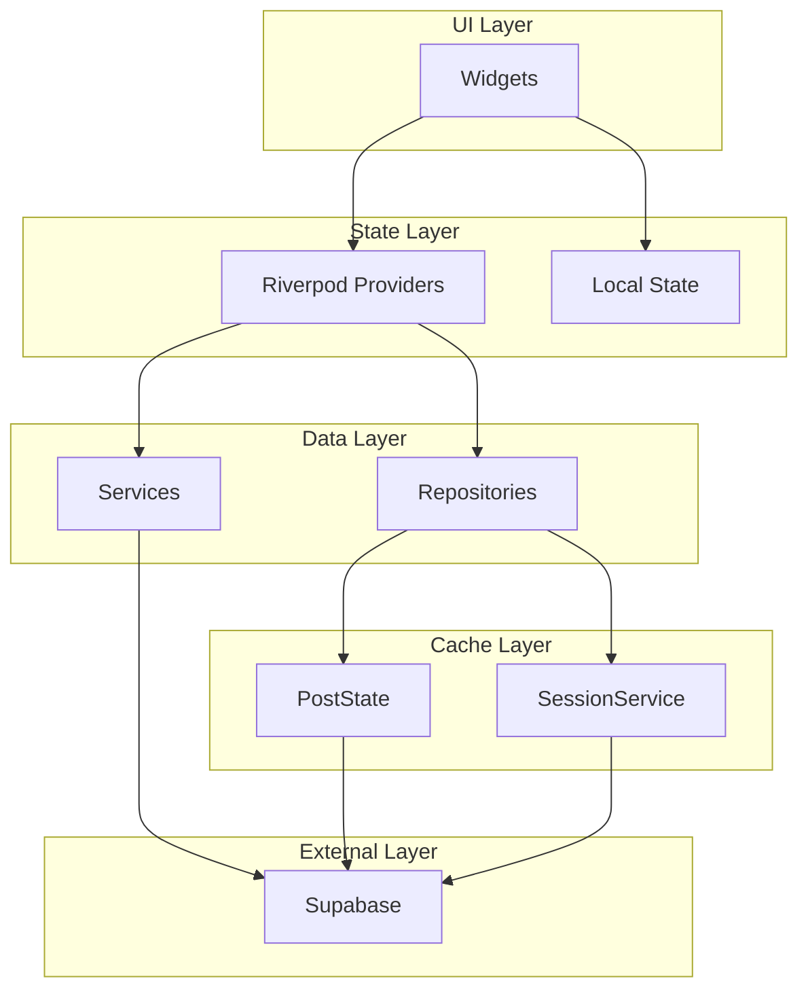

## Network Architecture

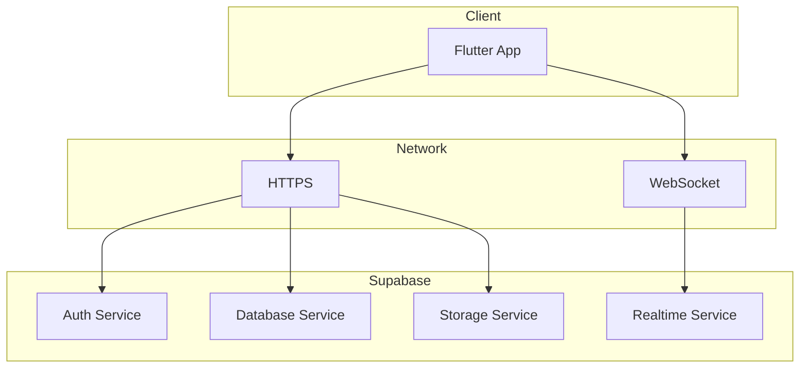

## Security Architecture

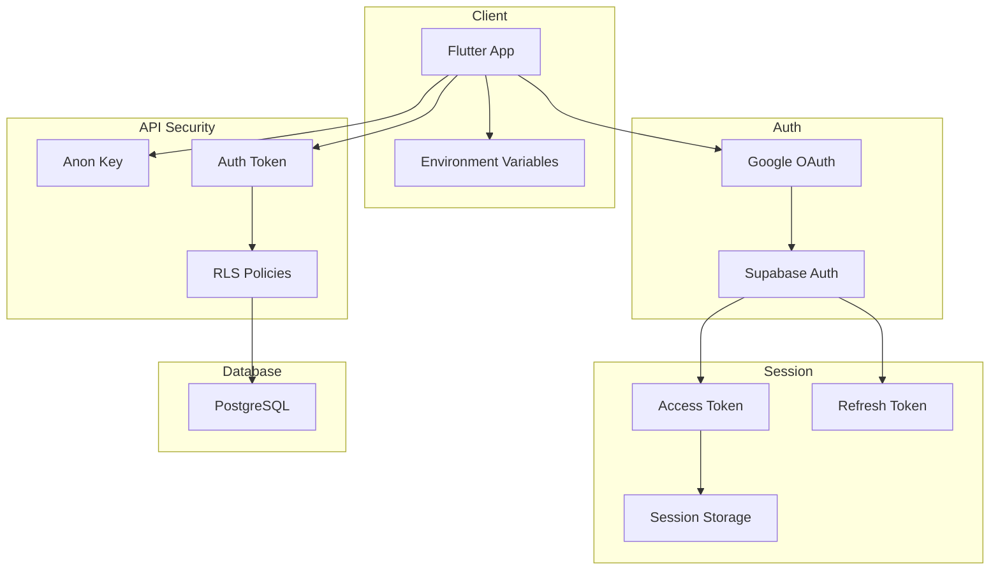

## Deployment Architecture

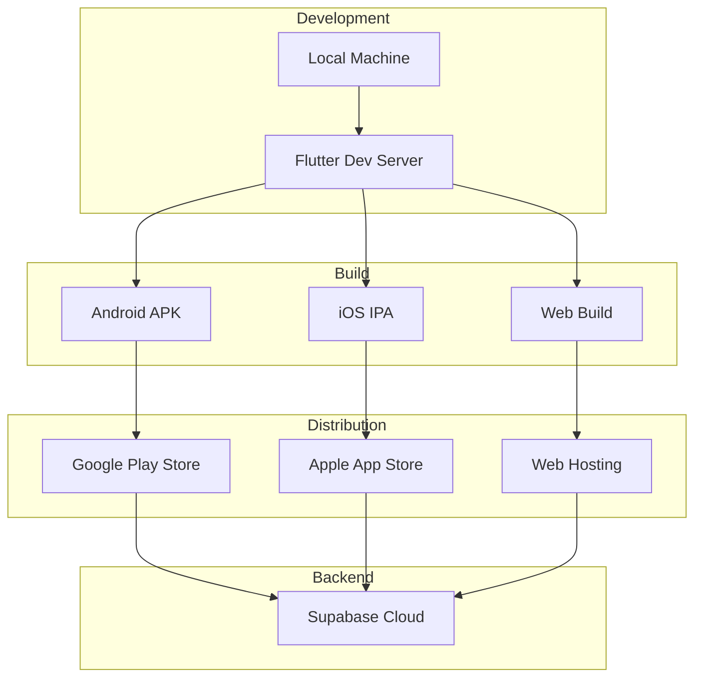

## Real-time Architecture

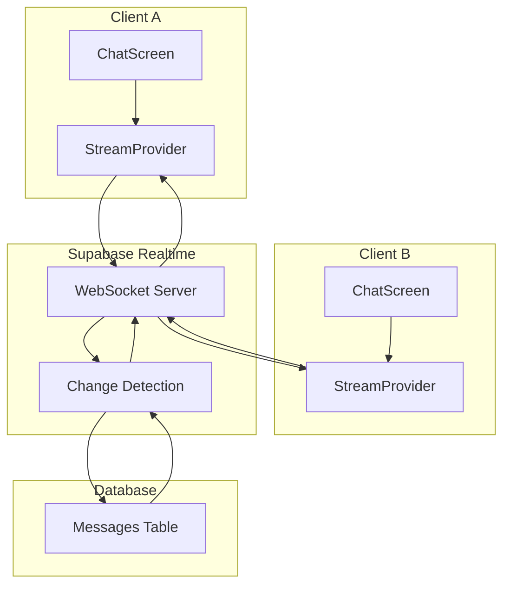

## File Upload Architecture

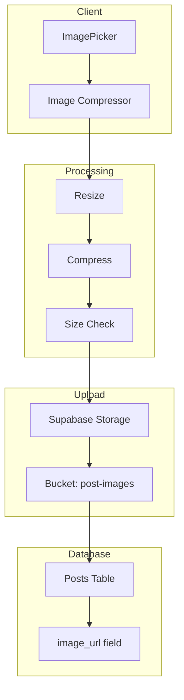

## Navigation Architecture

```mermaid
graph TB
    subgraph "GoRouter"
        A[Router]
        B[Route Configuration]
        C[Route Guards]
    end
    
    subgraph "Routes"
        D[/ - Auth]
        E[/feed - Feed]
        F[/chat - Chat]
        G[/admin - Admin]
        H[/complaints - Complaints]
    end
    
    subgraph "Screens"
        I[AuthScreen]
        J[FeedScreen]
        K[ChatScreen]
        L[AdminScreens]
        M[ComplaintsScreens]
    end
    
    A --> B
    A --> C
    B --> D
    B --> E
    B --> F
    B --> G
    B --> H
    D --> I
    E --> J
    F --> K
    G --> L
    H --> M
```

## Microservices-like Architecture (Supabase)

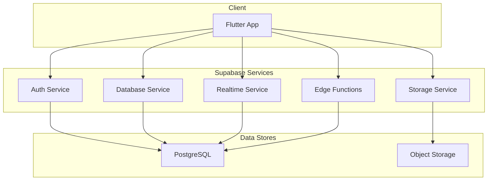

## Caching Architecture

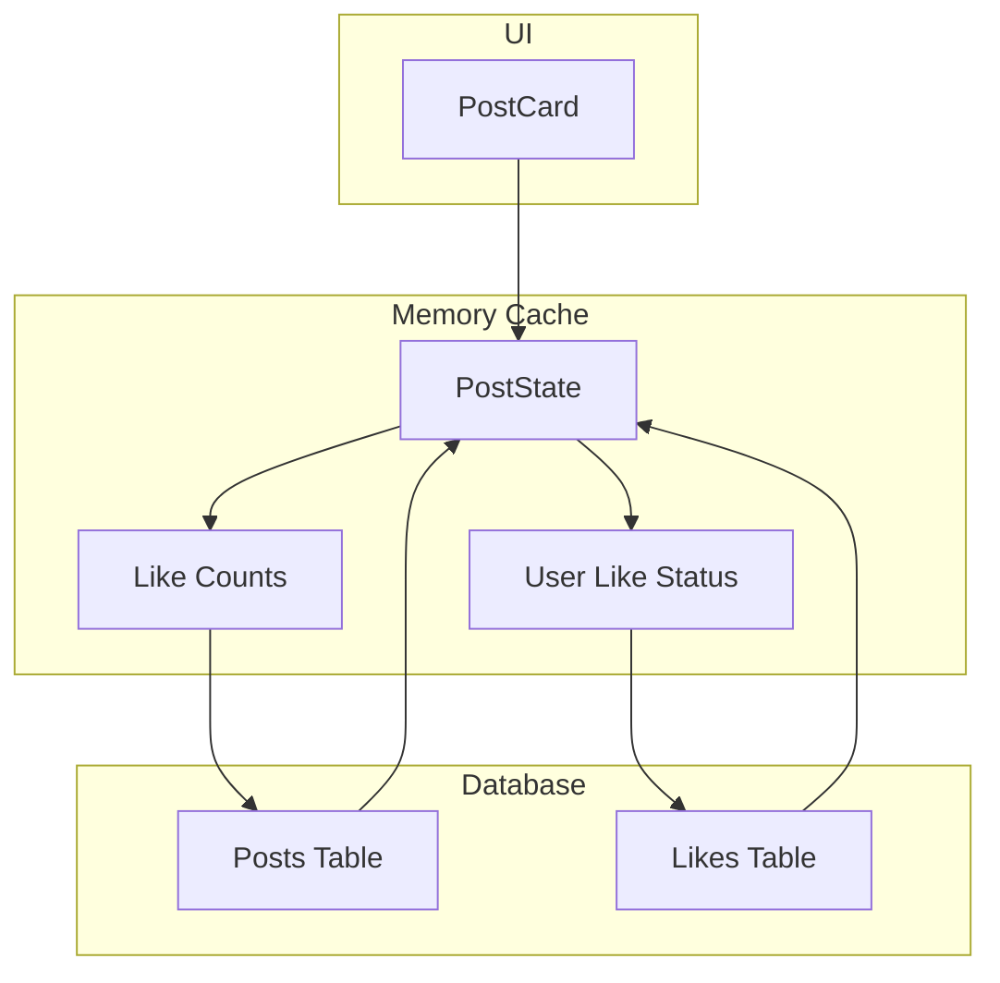

## Error Handling Architecture

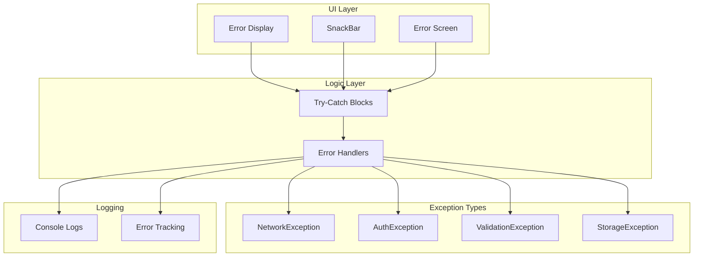
